本文翻译自：[Kubernetes Networking and Cilium ebook for networking engineers (isovalent.com)](https://isovalent.com/blog/post/introducing-the-new-kubernetes-networking-and-cilium-for-the-network-engineer-ebook/)

# Preface

The dread of Kubernetes Networking is real. 

对 Kubernetes 网络的恐惧是真实存在的。

<!-- more -->

Most Kubernetes operators can confidently deploy applications onto their clusters, but connecting and securing them evokes a sense of apprehension. This fear also applies to experienced network engineers: even CCIEs would need help with the subtleties and nuances of Kubernetes networking.

大多数 Kubernetes 操作员都能信心十足地将应用程序部署到集群上，但连接和保护它们却让人感到忧虑。这种恐惧同样适用于经验丰富的网络工程师：即使是 CCIE 也需要帮助来了解 Kubernetes 网络的微妙之处和细微差别。

I can relate: despite my CCIE and almost 20 years working in the networking industry, I found Kubernetes networking confusing. Frankly speaking, most content around Kubernetes Networking was not written with the network engineering community in mind. 

我深有体会：尽管我拥有 CCIE 证书，并在网络行业工作了近 20 年，但我还是觉得 Kubernetes 网络令人困惑。坦率地说，有关 Kubernetes 网络的大部分内容都不是针对网络工程社区编写的。

In this eBook, we will fill this void. 在本电子书中，我们将填补这一空白。

Given how ubiquitous Kubernetes has become, network engineers will increasingly need to understand Kubernetes and know how to configure, manage, and integrate clusters with the rest of the network.  鉴于 Kubernetes 已变得无处不在，网络工程师将越来越需要了解 Kubernetes，并知道如何配置、管理集群并将其与网络的其他部分集成。

This eBook will focus on the Kubernetes networking aspects and on what's now become the de facto networking platform for Kubernetes: Cilium. 本电子书将重点介绍 Kubernetes 网络方面的内容，以及目前已成为 Kubernetes 事实上的网络平台： Cilium。

It is written with you, network engineers, in mind, using words, references and terminology you will understand. 

本电子书以网络工程师为中心，使用您能理解的文字、参考资料和术语编写而成。

Whether you are beginning your journey as a network administrator or are an established network architect, we hope you find this useful.

无论您是刚刚开始网络管理员之旅，还是已经成为一名成熟的网络架构师，我们都希望您能从中找到有用的信息。

# Expectations

The expected audience for this eBook is the network engineering community, but we hope it's accessible to anyone. The main technical expectations we expect the reader to be familiar with are concepts such as: 

本电子书的预期读者群是网络工程社区，但我们希望任何人都能阅读。我们希望读者熟悉的主要技术期望是以下概念： 

* TCP/IP 
* OSI Layers 
* Virtualization and containerization 
* Core networking building blocks such as: 
  * DNS 
  * DHCP 
  * Routing 
  * Switching 
  * Load- balancing 
  * Firewalls

This eBook should be accessible to most engineers with a CCNA (Cisco Certified Network Associate)-level skillset. 

大多数具备 CCNA（思科认证网络助理）级别技能的工程师都可以阅读这本电子书。

Don't worry if you are not familiar with Kubernetes yet - we will explain some of the core building blocks before diving into its networking aspects. However, we expect the reader to be familiar with concepts such as virtualization and containerization and recommend the Kubernetes overview from the official Kubernetes documentation as pre-reading material. 

如果您对 Kubernetes 还不熟悉，也不必担心，我们将在深入介绍其网络方面的内容之前，先解释一些核心构建模块。不过，我们希望读者熟悉虚拟化和容器化等概念，并推荐将 Kubernetes 官方文档中的 Kubernetes 概述作为预读材料。

This document will not explain why Kubernetes has become so popular, why it's here to stay, or how becoming a Kubernetes networking expert could boost your career.

本文档不会解释 Kubernetes 为何如此流行、为何会继续存在，也不会解释成为 Kubernetes 网络专家会如何促进你的职业发展。

# What We Need The Network To Do

Regardless of the underlying computing abstractions - bare metal, virtual machine, container - there are common networking tenets that every platform should aspire to provide: 

无论底层计算抽象是什么--裸机、虚拟机、容器--每个平台都应致力于提供共同的网络原则： 

- We need our applications to have accessible IP addresses  我们需要应用程序拥有可访问的 IP 地址 
- We need our applications to be able to communicate with other applications  我们需要应用程序能够与其他应用程序通信 
- We need our applications to be able to access the outside world (outbound access) 我们需要应用程序能够访问外部世界（出站访问） 
- We need our applications to be accessible from the outside world (inbound access)  我们需要我们的应用程序能够从外部世界访问（入站访问） 
- We need our applications to be secured and our data protected  我们需要确保应用程序的安全并保护数据 
- We need our applications to be globally resilient and highly available  我们需要应用程序具有全球弹性和高可用性 
- We may need to meet regulatory goals and requirements 我们可能需要满足监管目标和要求 
- We need to be able to operate and troubleshoot when applications or the infrastructure misbehave 当应用程序或基础设施出现问题时，我们需要能够进行操作和故障排除

In the "traditional" world, we would have needed a combination of networking and security appliances to address all these requirements. This includes routers, switches, DNS and DHCP servers, load balancers, firewalls, network monitoring appliances, VPN devices, etc... 

在 "传统 "世界中，我们需要网络和安全设备的组合来满足所有这些要求。这包括路由器、交换机、DNS 和 DHCP 服务器、负载平衡器、防火墙、网络监控设备、VPN 设备等。

Throughout this document, we will address how these guiding principles can be addressed in Kubernetes.

在本文档中，我们将讨论如何在 Kubernetes 中贯彻这些指导原则。

> For the remainder of the eBook, we will refer to past networking practices as "traditional networking". We know this is an oversimplification, but please bear with us.
>
> 在本电子书的其余部分，我们将过去的联网做法称为 "传统联网"。我们知道这种说法过于简单，但请您谅解。

# Back To Basics

**回归基础**

Let's start with the basics and the Kubernetes concepts you must understand before we start diving into networking. 

在开始深入研究网络之前，让我们从基础知识和您必须了解的 Kubernetes 概念开始。

One of the core premises behind the use of cloud-native technologies is the adoption of micro- services. The micro- services model provides benefits such as increased scalability, agility, and resilience compared to the monolith application architecture model.  

使用云原生技术的核心前提之一是采用微服务。与单体应用架构模式相比，微服务模式具有更高的可扩展性、敏捷性和弹性等优势。

A monolith architecture consists of an entire application built as a single, tightly integrated unit. In contrast, a micro- services architecture deconstructs an application into a set of smaller, independent components - the micro- services. The applications running in micro- services can be updated independently, avoiding the development bottlenecks that can happen when developers work on the same codebase. 

单体架构包括作为单一、紧密集成单元构建的整个应用程序。相比之下，微服务架构将应用程序分解为一系列更小、更独立的组件--微服务。微服务中运行的应用程序可以独立更新，避免了开发人员在同一代码库中工作时可能出现的开发瓶颈。

The micro- services could be written in different programming languages, providing developers more flexibility in adopting new frameworks than the monolith model. 

微服务可以用不同的编程语言编写，这为开发人员采用新框架提供了比单体模式更大的灵活性。

This brings us to our first Kubernetes concept: the Kubernetes pod. 

这就引出了第一个 Kubernetes 概念：Kubernetes pod。

 A pod consists of one or more containers. A pod can represent an entire application, a single replica of a distributed application, or an individual service in a micro- service architecture.   

一个 pod 由一个或多个容器组成。一个 pod 可以代表整个应用程序、分布式应用程序的单个副本或微服务架构中的单个服务。

A pod will be running on a Kubernetes node. 

一个 pod 将运行在一个 Kubernetes 节点上。

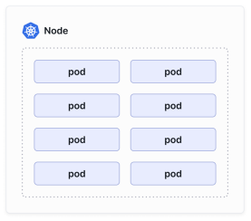

Both virtual machines (VMs) and bare metal servers can be used as nodes in Kubernetes clusters. Typically, when you deploy Kubernetes clusters in the cloud, you would be leveraging VMs as nodes. When you deploy Kubernetes on- premises, the nodes may also be bare- metal servers.  

虚拟机（VM）和裸机服务器都可以用作 Kubernetes 集群的节点。通常，在云中部署 Kubernetes 集群时，会利用虚拟机作为节点。在企业内部部署 Kubernetes 时，节点也可以是裸机服务器。

A group of nodes makes up a Kubernetes cluster. 

一组节点组成一个 Kubernetes 集群。

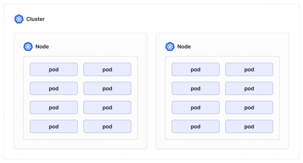

Kubernetes is most well- known as a container orchestrator and scheduler platform. In other words, it decides on which node a pod will run. If you're familiar with VMware - and many network engineers operating data center networks will be - you might be familiar with VMware DRS (Dynamic Resource Scheduler). DRS dynamically balances computing resources across a cluster of VMware ESXi hosts. Similarly, Kubernetes monitors the resource usage (CPU, memory) of nodes and schedules pods onto a node based on available resources (among other factors that can be administratively controlled).  

Kubernetes 作为容器编排器和调度器平台最为人熟知。换句话说，它决定 pod 在哪个节点上运行。如果你熟悉 VMware（许多操作数据中心网络的网络工程师都会熟悉），你可能会对 VMware DRS（动态资源调度器）有所了解。DRS 可以动态平衡 VMware ESXi 主机集群中的计算资源。同样，Kubernetes 也会监控节点的资源使用情况（CPU、内存），并根据可用资源（以及其他可管理控制的因素）将 pod 调度到节点上。

The component responsible for making global decisions about the cluster (including scheduling) is the control plane. You are probably familiar with the idea of a control plane from configuring routers: the control plane in a network determines how data packets are forwarded. Similarly, the Kubernetes control plane determines where pods should run. 

负责对集群做出全局决策（包括调度）的组件是控制平面。你可能在配置路由器时熟悉控制平面的概念：网络中的控制平面决定数据包的转发方式。类似地，Kubernetes 控制平面决定 pod 应在哪里运行。

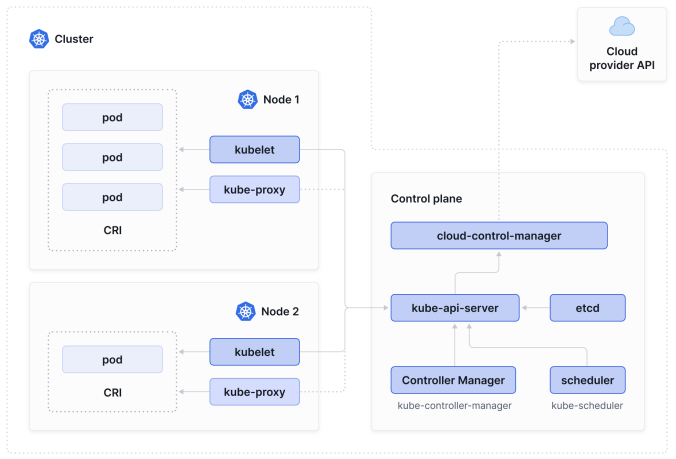

# Kubernetes Networking Fundamentals

**Kubernetes 网络基知识**

Now that we understand pods, nodes, and clusters, we can introduce the [Kubernetes network model](https://kubernetes.io/docs/concepts/services-networking/). 

在了解了 pod、节点和集群之后，我们就可以介绍 Kubernetes 网络模型了。

Firstly, every pod in a cluster gets its unique cluster- wide IP address and can communicate with all other pods on any other node without using Network Address Translation (NAT). A practical benefit is that Kubernetes users do not need to create links between pods to connect them explicitly.

首先，集群中的每个 pod 都有自己独一无二的集群范围 IP 地址，无需使用网络地址转换（NAT）就能与任何其他节点上的所有其他 pod 通信。一个实际的好处是，Kubernetes 用户无需在 pod 之间创建链接来明确连接它们。

Once you create pods, pods should receive a unique IP address and, assuming you have not configured some network segmentation policies (we will come to them later), be able to communicate directly with each other. 

一旦创建了 pod，pod 就会收到一个唯一的 IP 地址，而且如果没有配置一些网络分段策略（我们稍后再谈），它们之间就能直接通信。

Note that containers within a pod all share the same IP address and MAC address.

请注意，一个 pod 中的所有容器都共享相同的 IP 地址和 MAC 地址。

Kubernetes requires a Container Network Interface (CNI) [plugin](https://kubernetes.io/docs/concepts/extend-kubernetes/compute-storage-net/network-plugins/) to implement this model. 

Kubernetes 需要一个容器网络接口（CNI）插件来实现这一模式。

The  [CNI](https://www.cni.dev/) specifies how networking should be implemented in Kubernetes. Think of it as the [IETF RFCs](https://www.ietf.org/process/rfcs/) you may have consulted over the years. A CNI plugin is an actual implementation of said specification and is commonly referred to as a "CNI" (we will follow this terminology through the rest of this document).

CNI 规定了如何在 Kubernetes 中实现联网。把它想象成多年来你可能查阅过的 IETF RFC。CNI 插件是上述规范的实际实现，通常被称为 "CNI"（我们将在本文档的其余部分沿用这一术语）。

You must use a CNI compatible with your needs to meet your requirements. The feature set from one CNI to another greatly varies. 

您必须使用与您的需求兼容的 CNI 来满足您的要求。不同 CNI 的功能集差别很大。

Just like you, as a network architect, had to go through a network vendor selection (Cisco, Juniper, Arista, etc...) at the start of a networking project, operators and architects of Kubernetes clusters must select a CNI that provides the required networking, security, and observability features. The CNI that we will zoom in on this document - and the one that tends to win in most CNI evaluations - is the [Cilium](https://cilium.io/) project.

就像网络架构师在网络项目开始时必须选择网络供应商（思科、Juniper、Arista......）一样，Kubernetes 集群的操作员和架构师也必须选择能提供所需网络、安全和可观察性功能的 CNI。本文将重点介绍的 CNI，也是在大多数 CNI 评估中胜出的 CNI，是 [Cilium](https://cilium.io/) 项目。

# Introducing Cilium

**介绍 Cilium**

Cilium is a cloud native networking, security and observability platform. It provides most, if not all, connectivity, firewalling and network monitoring features required to operate and secure Kubernetes clusters. 

Cilium 是一个云本地网络、安全和可观察性平台。它提供运行和保护 Kubernetes 集群所需的大部分（如果不是全部）连接、防火墙和网络监控功能。

In words you may be more familiar with, it provides functions such routing, switching, load balancing, firewalling, VPN, web proxy, network monitoring, IP address management, Quality of Service and much more. Throughout the document, you will learn how these components are provided.

用您可能更熟悉的话来说，它提供了路由、交换、负载均衡、防火墙、VPN、Web 代理、网络监控、IP 地址管理、服务质量等功能。在整个文档中，你将了解到这些组件是如何提供的。

Cilium is an open- source solution and was donated to the [Cloud Native Computing Foundation](https://www.cncf.io/) (CNCF) in 2021. It has been under the neutral stewardship of the CNCF ever since. 

Cilium 是一个开源解决方案，于 2021 年捐赠给[云原生计算基金会](https://www.cncf.io/) (CNCF)。从那时起，它一直由 CNCF 中立管理。

Two years after its donation to the CNCF and after a thorough process involving due diligence reports and security audits, Cilium became and remains the first and only [Graduated CNCF](https://isovalent.com/blog/post/cilium-graduates-cncf/) project in the cloud- native networking category. It has been [adopted](https://cilium.io/adopters/) as the default CNI by most managed Kubernetes services and distributions.

在捐赠给CNCF两年后，经过尽职调查报告和安全审计等全面程序，Cilium成为并保持了云原生网络类别中第一个也是唯一一个[Graduated CNCF](https://isovalent.com/blog/post/cilium-graduates-cncf/)项目。它已被大多数托管 Kubernetes 服务和发行版[采用](https://cilium.io/adopters/) 作为默认 CNI。

Isovalent, the creator of the Cilium project, offers a hardened and enterprise edition of Cilium that comes with support and additional enterprise features. We will highlight a couple of these features later in this document, but first, let's answer a question that most network engineers will have been pondering:

Cilium 项目的创建者 Isovalent 提供了 Cilium 的加固企业版，该版本附带支持和额外的企业功能。本文稍后将重点介绍其中的几项功能，但首先让我们来回答一个大多数网络工程师都在思考的问题：

## Where is my CLI?

Most network engineers begin their networking apprenticeship on the CLI (Command Line Interface) of a network device. While studying for Cisco certifications such as CCNA, CCNP, and CCIE, I spent countless hours on the IOS command line. It remains the primary tool to configure and administer a network. 

大多数网络工程师的网络学徒生涯都是从网络设备的 CLI（命令行界面）开始的。在学习 Cisco 认证（如 CCNA、CCNP 和 CCIE）时，我在 IOS 命令行上花费了无数的时间。它仍然是配置和管理网络的主要工具。

While the IOS CLI interacts directly with a router's operating system, interacting with Kubernetes is done by communicating with one of the components of the Kubernetes control plane: the [Kubernetes API server](https://kubernetes.io/docs/concepts/overview/kubernetes-api/). 

IOS CLI 直接与路由器的操作系统交互，而与 Kubernetes 的交互则是通过与 Kubernetes 控制平面的组件之一：Kubernetes API 服务器通信来完成的。

It's typically done using the [kubectl](https://kubernetes.io/docs/reference/kubectl/) CLI - the Kubernetes equivalent of the IOS CLI. The kubectl CLI interacts with the Kubernetes API server to manage and control our Kubernetes cluster from the command line.

通常使用 kubectl CLI（相当于 IOS CLI 的 Kubernetes CLI）进行。kubectl CLI 与 Kubernetes API 服务器交互，通过命令行管理和控制我们的 Kubernetes 集群。

When we run a command such as the following, kubectl will communicate with the Kubernetes API server and return an output. This command shows the pods in our cluster in the default namespace (we'll explain namespaces later on):

当我们运行以下命令时，kubectl 会与 Kubernetes API 服务器通信并返回输出。该命令以 default 命名空间显示集群中的 pod（我们稍后会解释命名空间）：

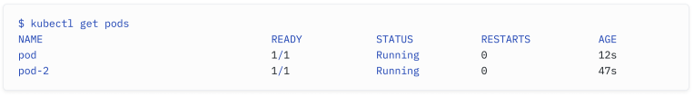

This more advanced command shows the IPs of our pods alongside the nodes they are running on:

这个更高级的命令会显示 pod 的 IP 和它们正在运行的节点：

## How do I configure Kubernetes and Cilium?

****

Network engineers have spent decades using `conf t` (`configure terminal `) to enter the configuration mode on a Cisco IOS device. After configuring our router, we would save the configuration to permanent memory by running commands such as `wri tememory` or `copy running-config startup-config`.

几十年来，网络工程师们一直使用 `conf t`（`configure terminal`）进入 Cisco IOS 设备的配置模式。配置完路由器后，我们会通过运行 `wri tememory` 或 `copy running-config startup-config` 等命令将配置保存到永久内存中。

You won't configure individual nodes because Kubernetes is a distributed system with a centralized control plane. Instead, the cluster configuration is done centrally and stored in a data store called [etcd](https://etcd.io/docs/), one of the components of the Kubernetes control plane. Just like you would back up your IOS configurations to a TFTP server, Kubernetes engineers should have a backup strategy in place in case etcd fails.

你不会配置单个节点，因为 Kubernetes 是一个具有集中控制平面的分布式系统。相反，集群配置是集中完成的，并存储在名为[etcd](https://etcd.io/docs/)的数据存储中，这是Kubernetes控制平面的组件之一。就像将 IOS 配置备份到 TFTP 服务器一样，Kubernetes 工程师也应制定备份策略，以防 etcd 出现故障。

Configuring Kubernetes will require you to apply a configuration to the cluster, typically using the `kubectl` CLI. You will see some files in the YAML format throughout this eBook: they are manifests that represent your desired state. When you run a command such as `kubectl apply -f manifest.yaml` , the `kubectl` tool will push the configuration to the Kubernetes API server. The Kubernetes control plane will then create the corresponding object. 

配置 Kubernetes 需要将配置应用到群集，通常使用 `kubectl` CLI。在本电子书中，你会看到一些 YAML 格式的文件：它们是代表你所需状态的清单。当你运行 `kubectl apply -f manifest.yaml` 等命令时，`kubectl` 工具会将配置推送到 Kubernetes API 服务器。然后，Kubernetes 控制平面将创建相应的对象。

As the Kubernetes documentation explains, a Kubernetes object is a "record of intent". When you create an object, you're effectively telling the Kubernetes system what your cluster's workload should look like; this is your cluster's desired state.

正如 Kubernetes 文档所解释的，Kubernetes 对象是意图的记录。当你创建一个对象时，实际上就是在告诉 Kubernetes 系统，你的集群的工作负载应该是什么样子；这就是你的集群所期望的状态。

> Note: If you're familiar with some of the software-defined networking concepts, then terms like "intent" and "desired state" should feel familiar.
>
> 注：如果您熟悉一些软件定义网络的概念，那么 "意图 "和 "期望状态 "等术语应该不会陌生。

Here is a sample manifest for a Pod named `tiefighter` . The Pod consists of a single container based on the `docker.io/cilium/json-mock` image.

下面是一个名为 `tiefighter` 的 Pod 的清单示例。Pod 由一个基于 `docker.io/cilium/json-mock` 镜像的容器组成。

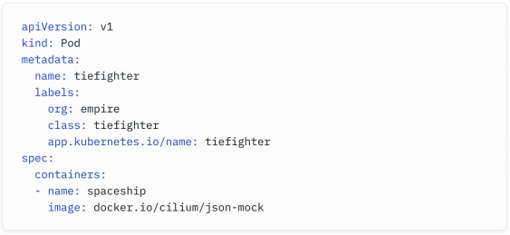

Cilium's configuration is stored in two separate entities. The main Cilium configuration is stored in a ConfigMap, while the Cilium policies (for network security, BGP, etc...) leverage Custom Resource Definitions (CRDs). Let's explain what both entail. 

Cilium 的配置存储在两个独立的实体中。主要的 Cilium 配置存储在 ConfigMap 中，而 Cilium 策略（用于网络安全、BGP 等......）则利用自定义资源定义（CRD）。让我们来解释一下两者的含义。

ConfigMaps are used within Kubernetes to store non- confidential information. A ConfigMap consists of key/value pairs. Cilium's configuration is stored in a ConfigMap called `cilium-config`. With the following lengthy command, you can check the Cilium configuration and filter whether IPv6 has been enabled.

在 Kubernetes 中，ConfigMap 用于存储非机密信息。ConfigMap 由键/值对组成。Cilium 的配置存储在名为 `cilium-config `的 ConfigMap 中。使用下面的冗长命令，你可以检查 Cilium 配置并过滤 IPv6 是否已启用。

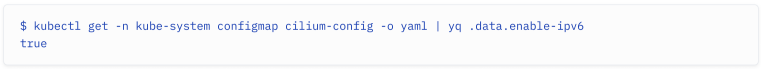

To make things simpler, users can also use the [Cilium CLI](https://github.com/cilium/cilium-cli) to install and manage Cilium. The Cilium CLI is a binary that helps users install, manage, and configure Cilium. The following Cilium command displays the Cilium configuration, with a filter on the IPv6 setting:

为了简化操作，用户还可以使用 [Cilium CLI](https://github.com/cilium/cilium-cli) 来安装和管理 Cilium。Cilium CLI 是一个二进制文件，可帮助用户安装、管理和配置 Cilium。以下 Cilium 命令显示了 Cilium 配置，并对 IPv6 设置进行了过滤：

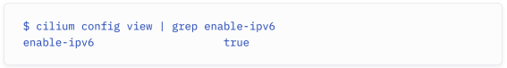

This CLI tool will interface with the Kubernetes API as necessary, similar to that of kubectl. 

此 CLI 工具将根据需要与 Kubernetes API 交互，类似于 kubectl 的工具。

Cilium - and many other Kubernetes tools - also use Custom Resource Definitions (CRDs) to extend Kubernetes. These CRDs allow users to define and manage additional resources beyond the standard Kubernetes objects. Examples of Cilium CRDs include CiliumNetworkPolicies and CiliumBGPPeeringPolicies. We will review some of these CRDs later on.

Cilium 和许多其他 Kubernetes 工具还使用自定义资源定义（CRD）来扩展 Kubernetes。这些 CRD 允许用户定义和管理标准 Kubernetes 对象之外的额外资源。Cilium CRD 的例子包括 CiliumNetworkPolicies 和 CiliumBGPPeeringPolicies。稍后我们将回顾其中一些 CRD。

## Where is my DHCP Server?

**我的DHCP服务器在哪里？**

In traditional networking, a DHCP server allocates IP addresses to a server as it comes online (unless static addressing is used). 

在传统网络中，DHCP 服务器会在服务器上线时为其分配 IP 地址（除非使用静态寻址）。

While the nodes would typically receive their IP address over DHCP, we do not use it for pods. Instead, we refer to **IPAM** (IP Address Management), a term you might be familiar with if you?ve used platforms like Infoblox for your network. 

虽然节点通常会通过 DHCP 接收 IP 地址，但我们并没有将其用于 pod。取而代之的是 **IPAM**（IP 地址管理），如果您在网络中使用过 Infoblox 等平台，可能会对这个术语感到熟悉。

In Kubernetes, the CNI is often responsible for assigning an IP address to your pod. Remember, though, that while a pod frequently consists of multiple containers, a pod only receives a single IP, which is shared by all containers in the pod. 

在 Kubernetes 中，CNI 通常负责为 pod 分配 IP 地址。但请记住，虽然 pod 通常由多个容器组成，但 pod 只接收一个 IP，该 IP 由 pod 中的所有容器共享。

The IP assigned to a pod comes from a subnet referred to as "PodCIDR". You might remember the concept of CIDR - Classless Inter- Domain Routing - from doing subnet calculations. In Kubernetes, just think of a PodCIDR as the subnet from which the pod receives an IP address.

分配给 pod 的 IP 来自一个称为 "PodCIDR "的子网。你可能还记得 CIDR（无类别域间路由）的概念，它来自子网计算。在 Kubernetes 中，只需将 PodCIDR 视为 pod 接收 IP 地址的子网即可。 

Cilium supports multiple IPAM modes to address Kubernetes users' different requirements. Let's review three IPAM modes:

Cilium 支持多种 IPAM 模式，以满足 Kubernetes 用户的不同需求。让我们回顾一下三种 IPAM 模式：

* In Kubernetes-host scope [mode](https://docs.cilium.io/en/stable/network/concepts/ipam/kubernetes/) (or per-Node PodCIDR), a single large cluster- wide prefix is assigned to a cluster, and Kubernetes carves out a subnet of that prefix for every node. Cilium would then assign IP addresses from each subnet. However, if you were to run out of IPs in your prefix, you would not be able to expand the cluster pool. 
* 在 Kubernetes 主机范围模式（或按节点 PodCIDR）中，一个大型集群范围前缀被分配给一个集群，Kubernetes 为每个节点划分出该前缀的一个子网。然后，Cilium 将为每个子网分配 IP 地址。但是，如果前缀中的 IP 用完，就无法扩展群集池。
* In Cluster scope [mode](https://docs.cilium.io/en/stable/network/concepts/ipam/cluster-pool/), Cilium is responsible for assigning CIDRs to each node, and as a bonus, it lets you add more prefixes to your cluster if you begin to run out of IPs. Just remember that pods on the same node would receive IP addresses from the same range in the first two modes. 
* 在集群范围模式下，Cilium 负责为每个节点分配 CIDR，如果 IP 开始用完，还能为集群添加更多前缀。请记住，在前两种模式下，同一节点上的 pod 将从同一范围接收 IP 地址。
* The Multi-pool [mode](https://docs.cilium.io/en/stable/network/concepts/ipam/multi-pool/) is the most flexible one. It supports allocating PodCIDRs from multiple different IPAM pools, depending on properties of the workload defined by the user, e.g., annotations. Pods on the same node can receive IP addresses from various ranges. In addition, PodCIDRs can be dynamically added to a node as and when needed.
* 多池模式是最灵活的模式。它支持根据用户定义的工作负载属性（如注释），从多个不同的 IPAM 池中分配 PodCIDR。同一节点上的 Pod 可以接收来自不同范围的 IP 地址。此外，PodCIDR 可在需要时动态添加到节点上。

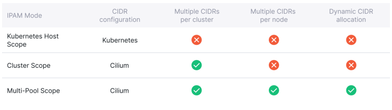

## What is a Kubernetes namespace?

**什么是Kubernetes命名空间?**

Kubernetes brings the concept of a [namespace](https://kubernetes.io/docs/concepts/overview/working-with-objects/namespaces/) which serves to isolate groups of resources within a cluster. The segmentation is minimal: using multiple namespaces does not stop pods in a namespace from communicating with pods in other namespaces. 

Kubernetes 引入了 [命名空间](https://kubernetes.io/docs/concepts/overview/working-with-objects/namespaces/) 的概念，它用于在集群内部隔离资源组。这种分割是最小化的：使用多个命名空间并不会阻止一个命名空间中的 pod 与其他命名空间中的 pod 进行通信。

The following command shows the active namespaces in our cluster:

以下命令显示了集群中的活动命名空间：

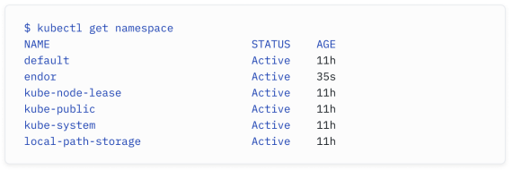

Operators would typically segregate an application or a tenant in its own namespace and then apply a quota. With a quota, you can limit the resources (CPU/Memory/Storage) used by pods in a specific namespace - quotas are to compute and storage resources what Quality of Service (QoS) is to networking (note: we will later discuss how to enforce networking quality of service in Kubernetes). 

运营商通常会将一个应用程序或租户分隔到自己的命名空间中，然后应用配额。通过配额，您可以限制特定命名空间中的 pod 使用的资源（CPU/内存/存储） - 配额对计算和存储资源来说就像网络质量服务 (Quality of Service, QoS) 对网络一样（注意：我们稍后将讨论如何在 Kubernetes 中实施网络质量服务）。

Note that pods in different namespaces on the same node may pick up IP addresses from the same range. As you can see from the command below, a pod in the `default` namespace and one in the `endor` namespace receive IP addresses from the same PodCIDR and should be able to communicate with each other (unless network segmentation has been implemented).

请注意，同一节点上不同命名空间中的 pod 可能会从相同范围内获取 IP 地址。如下面的命令所示，位于 `default` 命名空间和 `endor` 命名空间中的 pod 从相同的 PodCIDR 接收 IP 地址，并且应该能够彼此通信（除非实施了网络分割）。

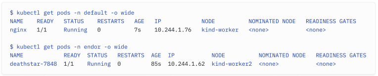

This is an essential concept in Kubernetes: IP addresses are irrelevant. While we used to remember the IP addresses of our favorite servers in networks of the past, they no longer represent an identity in the cloud- native space.

这是 Kubernetes 中的一个关键概念：IP 地址是无关紧要的。虽然在过去的网络中，我们习惯记住我们喜爱的服务器的 IP 地址，但它们在云原生空间中不再代表一个身份。

## Where is my DNS Server?

**我的DNS服务器在哪里？**

Now that we know how pods get an IP, let's look at how they get a DNS record. DNS is not part of the CNI?s role - a Kubernetes cluster comes with a built-in [DNS server](https://kubernetes.io/docs/concepts/services-networking/dns-pod-service/) (typically, coreDNS) that automatically assigns names based on the namespace and cluster name.

在 Kubernetes 中，我们知道了 pod 如何获取 IP 地址，现在让我们看看它们如何获取 DNS 记录。DNS 不是 CNI 的职责范围 - 一个 Kubernetes 集群自带一个内置的 [DNS 服务器](https://kubernetes.io/docs/concepts/services-networking/dns-pod-service/)（通常是 CoreDNS），它根据命名空间和集群名称自动分配名称。

For example, a pod would get a name such as `10-244-1-234.default.pod.cluster.local` , assuming its IP is `10.244.1.234`. We will cover services later in the load balancing section, but know that a service name will have a format such as `my-service.my-namespace.svc.my-cluster.local` . 

例如，一个 pod 的名称可能是 `10-244-1-234.default.pod.cluster.local`，假设它的 IP 是 `10.244.1.234`。我们稍后会在负载均衡部分介绍服务，但要知道服务名称的格式可能是 `my-service.my-namespace.svc.my-cluster.local`。

By default, pods are assigned a DNS policy called `ClusterFirst `. When using this policy, any DNS query that does not match the configured cluster domain suffix is forwarded to an upstream nameserver by the DNS server. DNS policies can be set on a per-Pod basis.

默认情况下，pod 被分配了一个名为 `ClusterFirst` 的 DNS 策略。使用此策略时，任何不符合配置的集群域名后缀的 DNS 查询都将由 DNS 服务器转发到上游DNS服务器。DNS 策略可以根据每个 Pod 进行设置。

> 译者注：简单来说，如果一个 DNS 查询不是针对 Kubernetes 集群内部的服务或 Pod 的名称，它就会被发送到外部的 DNS 服务器进行处理。

> If you used to blame DNS for most networking issues, you might be somehow reassured that [DNS is often the culprit in Kubernetes, too](https://isovalent.com/blog/post/its-dns/).
>
> 如果你过去常常将大多数网络问题归咎于 DNS，你可能会稍感安心，因为 [DNS 在 Kubernetes 中也经常是罪魁祸首](https://isovalent.com/blog/post/its-dns/)。

## How Do Pods Talk To Each Other?

**Pos如何与彼此对话？**

As a network engineer, you need to understand how endpoints communicate - clients and servers, bare metal servers and virtual machines, wireless clients and access points. 

作为一名网络工程师，你需要理解终端点之间的通信方式 - 客户端和服务器、裸机服务器和虚拟机、无线客户端和接入点。

You would have had to learn various layers of network abstractions (VLAN, VXLAN, GENEVE, GRE, MPLS) and multiple networking protocols (BGP, OSPF, EIGRP, RIP...). 

你必须学习各种网络抽象层（VLAN、VXLAN、GENEVE、GRE、MPLS）和多种网络协议（BGP、OSPF、EIGRP、RIP...）。

Kubernetes and Cilium are no different. You will actually be able to re- use a lot of what you've already learned. 

Kubernetes 和 Cilium 并无不同。你实际上将能够重复使用你已经学到的很多知识。

Cilium provides two methods to connect pods on different nodes in the same cluster: encapsulation/overlay routing and native/direct routing. 

Cilium 提供了两种方法来连接同一集群中不同节点上的 Pod：封装/覆盖路由和本地/直接路由。

The default one and the one you are most likely to come across is the "encapsulation" mode, where a network overlay (typically VXLAN, but GENEVE is also an option) is created in the cluster, and a group of tunnels is created between all the nodes.

默认情况下，你最有可能遇到的是“封装”模式，在此模式下，集群中会创建一个网络覆盖（通常是 VXLAN，但也可以选择 GENEVE），并在所有节点之间创建一组隧道。

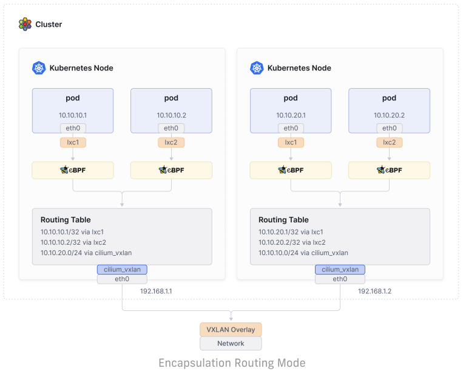

This provides a set of benefits: 

这提供了一系列的好处：

* **No reliance on the underlying network** - the network that connects the nodes does not need to be made aware of the Pod CIDRs. As long as the nodes can communicate, the pods should be able to communicate. 
* **不依赖于底层网络** - 连接节点的网络不需要知道 Pod CIDR。只要节点可以通信，Pod 就应该能够通信。
* **Overcoming addressing space challenges** - given that there's no dependence on the underlying network, there is potentially a much larger set of IP addresses available to pods. 
* **克服地址空间挑战** - 鉴于不依赖于底层网络，可能有更大的一组 IP 地址可用于 Pod。
* **Auto-configuration and simplicity** - new nodes joining the cluster will automatically be incorporated into the overlay.
* **自动配置和简单性** - 加入集群的新节点将自动并入覆盖网络。

The only drawback is common to any platforms using network overlays - like Cisco ACI or VMware NSX; the overlay implies adding an encapsulation header. Fifty bytes per network packet for VXLAN for every 1500 bytes (assuming no jumbo frames) is marginal, but some organizations need their network to provide optimal network performance. For them, the native routing mode might be more appropriate. 

唯一的缺点与使用网络覆盖的任何平台都相同 - 例如 Cisco ACI 或 VMware NSX；覆盖意味着添加封装头。对于每 1500 字节的网络数据包，VXLAN 每个数据包需要 50 字节的封装头（假设没有巨型帧），这在边缘情况下是可以接受的，但一些组织需要他们的网络提供最佳的网络性能。对于他们来说，本地路由模式可能更合适。

In native routing, the packets sent by the pods would be routed as if a local process had emitted the packet. As a result, the network connecting the nodes must be capable of routing the IP addresses allocated from the PodCIDRs. The Linux kernel on each node must be aware of how to forward packets to pods - in other words, they need to know how to route the packets!

在本地路由中，由 Pod 发送的数据包将被路由，就好像本地进程发出了该数据包一样。因此，连接节点的网络必须能够路由从 PodCIDR 分配的 IP 地址。每个节点上的 Linux 内核必须知道如何转发数据包到 Pod - 换句话说，它们需要知道如何路由数据包！

If all nodes share a single flat L2 network, Cilium offers an option that tells every node about each PodCIDR. If not, the nodes will need to rely on an external router with that knowledge or will need to run an internal BGP daemon.

如果所有节点共享一个单一的扁平 L2 网络，Cilium 提供了一个选项，告知每个节点有关每个 PodCIDR 的信息。如果不是这样，节点将需要依赖具有该知识的外部路由器，或者需要运行内部 BGP 守护程序。

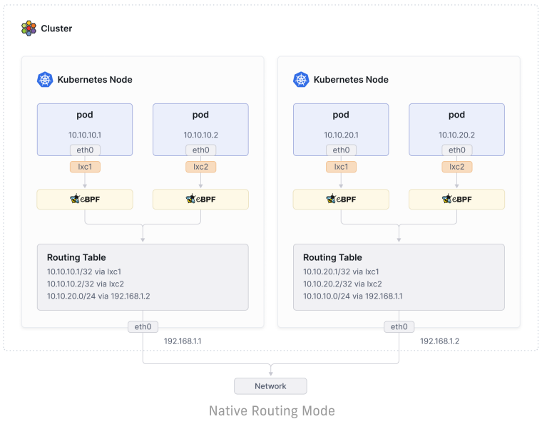

# Kubernetes Metadata

**Kubernetes 元数据**

In our traditional world of networking, keeping track of assets connected to the network and the network itself is an ongoing challenge. Ideally, enterprise organizations might have up-to- date network diagrams or use IPAM tools like Infoblox but we know many folks still rely on Excel spreadsheets. 

在我们传统的网络世界中，跟踪连接到网络的资产以及网络本身是一个持续的挑战。理想情况下，企业组织可能会拥有最新的网络图表，或者使用像Infoblox这样的IPAM工具，但我们知道许多人仍然依赖Excel电子表格。

Understanding which device is connected to the network, which role the networked entity serves, and which application it is supporting is tremendously useful for IT operators but creating and managing the information and metadata relevant to each networked device is time consuming. 

了解哪个设备连接到网络，网络实体扮演的角色以及它支持的应用程序是IT运营人员极其有用的，但创建和管理与每个网络设备相关的信息和元数据是耗时的。

In Kubernetes, we can assign metadata to our objects. While this doesn't constitute documentation, it can be used by operators to find out additional information about our applications. It can also be used for load balancing and security purposes. Let's review the two methods to assign metadata:

在Kubernetes中，我们可以为我们的对象分配元数据。虽然这并不构成文档，但运营人员可以使用它来查找关于我们的应用程序的额外信息。它还可以用于负载均衡和安全目的。让我们回顾一下分配元数据的两种方法：

## What's a Label?

**什么是标签？**

[Kubernetes labels](https://kubernetes.io/docs/concepts/overview/working-with-objects/labels/) are ways to organize and group your resources. Of course, you would also find labels on your servers and cables in a well- maintained data center with a documented and clear color scheme and naming convention. A glance at the label should inform you where the cable goes or which workload it is running. 

[Kubernetes标签](https://kubernetes.io/docs/concepts/overview/working-with-objects/labels/)是组织和分组资源的方式。当然，在一个维护良好、有文档记录和清晰的颜色方案和命名约定的数据中心中，您也会在服务器和电缆上找到标签。一眼看到标签就应该告诉您电缆的去向或者它正在运行哪个工作负载。

Kubernetes labels are similar - they?re a well- structured method to indicate to Kubernetes what a pod is and how to distinguish it from other objects. 

Kubernetes标签类似 - 它们是一种良好结构化的方法，用于告诉Kubernetes一个Pod是什么以及如何将其与其他对象区分开来。

The following pod manifest has multiple labels to describe the application, the tier, and the environment where the pod is being deployed.

以下的Pod清单具有多个标签，用于描述应用程序、层级和Pod部署的环境。

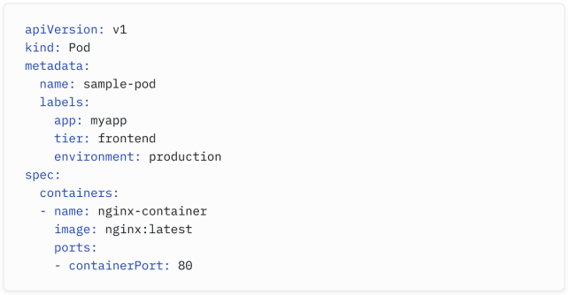

Unlike traditional networking, labels play an essential role in load balancing and security. We will review this shortly.

与传统网络不同，标签在负载均衡和安全方面发挥着关键作用。我们将很快对此进行回顾。

## What's an Annotation?

**什么是注释？**

While labels are a well- organized way to assign data, I refer to [Kubernetes annotations](https://kubernetes.io/docs/concepts/overview/working-with-objects/annotations/) as institutional knowledge about our resources. As mentioned, we, network engineers, all have used spreadsheets and Post-it notes to document our network - annotations play a similar role: they're unstructured information about pods that other humans or tools may want to consult or use. 

标签是一种组织良好的分配数据的方式，而我将[Kubernetes注释](https://kubernetes.io/docs/concepts/overview/working-with-objects/annotations/)称为关于我们资源的制度知识。正如前面提到的，我们，网络工程师，都曾经使用电子表格和便条纸来记录我们的网络 - 注释发挥着类似的作用：它们是关于Pod的非结构化信息，其他人或工具可能希望查询或使用。

Kubernetes annotations often provide documentation and context about Kubernetes objects like pods and services. As we will see in the Ingress routing and Quality of Service sections later, they can also be interpreted by external systems to add additional functionality to Kubernetes.

Kubernetes注释通常提供关于Pod和服务等Kubernetes对象的文档和上下文信息。正如我们稍后将在Ingress路由和服务质量部分看到的那样，它们也可以被外部系统解释，以为Kubernetes添加额外功能。

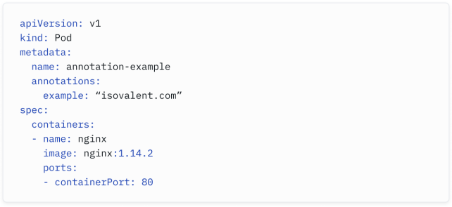

# How do I secure my cluster?

**如何保护我的集群？**

As you can imagine, Kubernetes Security is very complex and covers multiple areas such as data encryption at rest and in transit, protection of the control plane and workloads, auditing, Identity and Access Management - the list goes on. Some highly recommended [books](https://www.oreilly.com/library/view/container-security/9781492056690/) have been published and dedicated to Kubernetes Security. Let's focus on one aspect of security you would probably be interested in and answer the question:

正如你所能想象的，Kubernetes安全非常复杂，涵盖了诸多领域，如数据在静态和传输中的加密、控制平面和工作负载的保护、审计、身份和访问管理等等。一些非常推荐的[书籍](https://www.oreilly.com/library/view/container-security/9781492056690/)已经出版，专门讨论了Kubernetes安全。让我们专注于你可能感兴趣的安全方面并回答以下问题：

> What is the equivalent of firewall rules in Kubernetes?  在Kubernetes中等同于防火墙规则的是什么？
>
> The answer is [Network Policies](https://kubernetes.io/docs/concepts/services-networking/network-policies/). 答案是[网络策略(Network Policies)](https://kubernetes.io/docs/concepts/services-networking/network-policies/)。

Kubernetes Network Policies are implemented by the network plugin/CNI. Not all CNIs support network policies; some provide more advanced and granular network policies than most (we will review the benefits of using Cilium Network Policies shortly). 

Kubernetes网络策略由网络插件/CNI实现。并非所有的CNI都支持网络策略；一些提供比大多数更高级和精细的网络策略（我们将很快回顾使用Cilium网络策略的好处）。

Standard Kubernetes Network Policies let you specify how a pod can communicate with various entities. They rely on Layer 3 and 4 elements and let you filter based on IP addresses or ports/protocols (such as TCP:80 for HTTP or TCP:22 for SSH).

标准的Kubernetes网络策略允许你指定一个Pod如何与各种实体进行通信。它们依赖于第三层和第四层的元素，并允许你基于IP地址或端口/协议（比如TCP:80用于HTTP或TCP:22用于SSH）进行过滤。

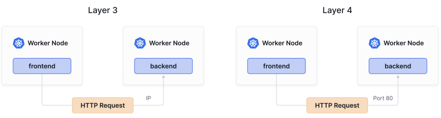

We'll now review a sample Network Policy. 

我们现在将审查一个示例网络策略。

It should look familiar to most network engineers, but you might find some configuration aspects new.

对于大多数网络工程师来说，这应该看起来很熟悉，但你可能会发现一些配置方面是新的。

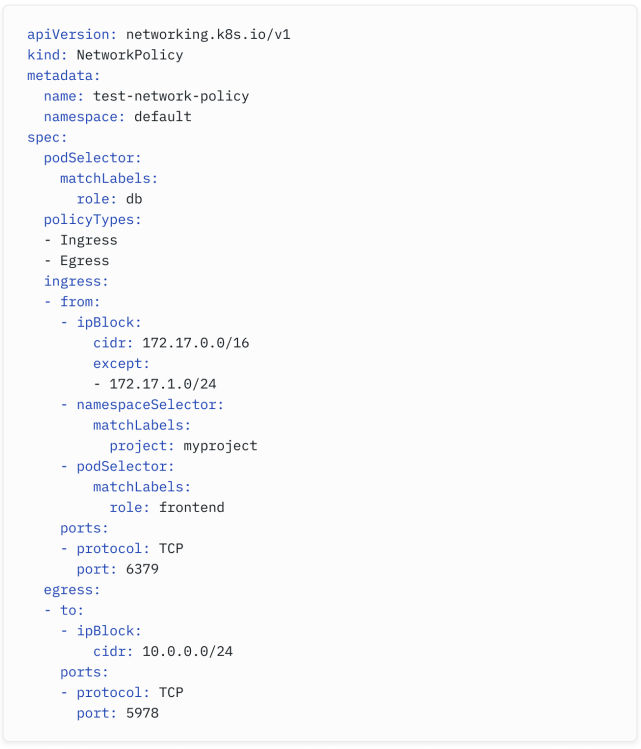

In the networking world, you would be familiar with an extended Access List (ACL) for example:

在网络领域，你可能熟悉扩展的访问控制列表（ACL）作为一个例子：

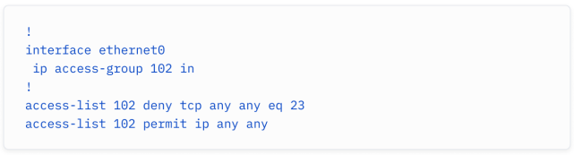

It denies all TCP traffic over port 23 (Telnet) and allows anything else. 

它拒绝所有通过端口23（Telnet）的TCP流量，并允许其他任何流量。

Note that the ACL applies to traffic entering (in) the Ethernet0 interface - in other words, it's our selector: we select the traffic to which this particular filter applies. 

请注意，ACL适用于进入（in）Ethernet0接口的流量 - 换句话说，它是我们的选择器：我们选择哪些特定流量应用此过滤器。

In Network Policies, we use a podSelector to determine who the filters will apply to. An empty one would select all the pods in the namespace. A standard method is to use labels to identify the pods the policy applies to.

在网络策略中，我们使用 podSelector 来确定过滤器将应用于哪些流量。一个空的 podSelector 将选择命名空间中的所有 Pod。一个标准的方法是使用标签来识别策略适用的 Pod。

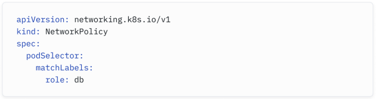

In the ACL example above, we used the keyword in to indicate the rules would apply to traffic entering the interface. In Kubernetes Network Policies, we would use the `ingress` block:

在上面的ACL示例中，我们使用关键字"in"来指示规则将应用于进入接口的流量。在Kubernetes网络策略中，我们将使用 `ingress` block：

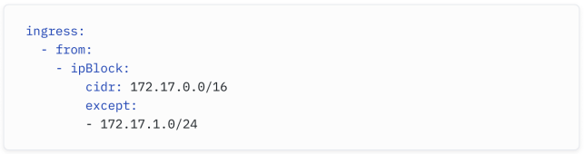

Consider the example above - you can see how we are allowing traffic from the `172.17.0.0/16` block, except the `172.17.1.0/24` range.

在上面的示例中，你可以看到我们允许来自 `172.17.0.0/16` 网段的流量，除了 `172.17.1.0/24` 范围。

In a Cisco ACL, the equivalent would be something like this:

在Cisco ACL中，相当于这个的配置可能是这样的：

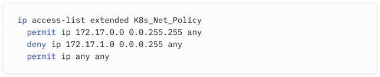

But we can also combine it with selectors - we can allow traffic only it comes from particular blocks, from a specific namespace, and from a specific pod:

但我们也可以与选择器结合使用 - 我们可以只允许来自特定网段、特定命名空间和特定 Pod 的流量：

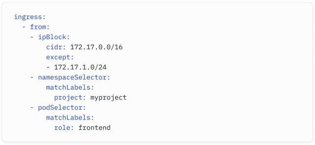

Why would we do this when IP addresses were all we needed in Cisco IOS ACL? As mentioned earlier, IP addresses are primarily irrelevant in Kubernetes. Pods are started and destroyed frequently. One of the advantages of Kubernetes is its ability to scale up and down an application by creating or deleting multiple replicas of a pod across the cluster. The IP addresses of pods are unpredictable. Traditional IP- based firewalling approaches are going to be mostly ineffective.

在Kubernetes中，为什么我们要这样做，而在Cisco IOS ACL中我们只需要IP地址呢？正如前面提到的，IP地址在Kubernetes中主要是无关紧要的。Pod会频繁启动和销毁。Kubernetes的一个优点是它能够通过在集群中创建或删除多个Pod副本来扩展或缩减应用程序。Pod的IP地址是不可预测的。传统的基于IP的防火墙方法大多会失效。

# What's identity-based security?

**什么是基于身份的安全？**

Cilium's Network Policies are an advanced method to secure clusters. For the reasons highlighted above, Cilium's approach to security is not based on IP addresses but on identities. Identities are derived from labels and other metadata and are assigned to endpoints (Cilium refers to Kubernetes pods as endpoints). 

Cilium的网络策略是保护集群的高级方法。正如前面所强调的原因，Cilium的安全性方法不是基于IP地址，而是基于身份。身份是从标签和其他元数据派生的，并分配给端点（Cilium将Kubernetes的Pod称为端点）。

Instead of creating a rule allowing traffic from the `frontend` pod's IP address to the `backend` pod's IP address, you would create a rule to allow an endpoint with the Kubernetes label `role=frontend` to connect to any endpoint with the Kubernetes label `role=backend`. 

与其创建一个允许从 `frontend` Pod 的IP地址到 `backend` Pod 的IP地址的规则，你将创建一个规则，允许具有 Kubernetes 标签 `role=frontend` 的端点连接到具有 Kubernetes 标签 `role=backend` 的任何端点。

Whenever replica pods are created with such labels, the network policy will automatically apply to such pods, meaning you will not have to update the existing network policy with the IP addresses of the new pods. 

每当带有这些标签的副本Pod被创建时，网络策略将自动应用于这些Pod，这意味着你不必更新现有的网络策略以包含新Pod的IP地址。

Another benefit provided by Cilium Network Policies is Layer 7 filtering.

Cilium网络策略提供的另一个好处是Layer 7过滤。

# Where's my Layer 7 firewall?

**我的第 7 层防火墙在哪里？**

Cilium Network Policies also provide Layer 7 application visibility and control. You will be familiar with this concept if you use any web application firewalls (WAFs). Cilium Network Policies let you filter based on application (Layer 7) parameters, like HTTP path, method, or domain names.

Cilium网络策略还提供了第7层应用程序的可见性和控制。如果你使用任何Web应用程序防火墙（WAF），你会对这个概念很熟悉。Cilium网络策略允许你基于应用程序（第7层）参数进行过滤，如HTTP路径、方法或域名。

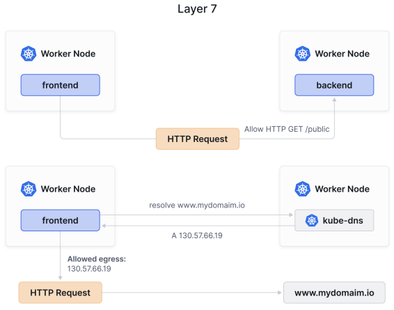

Let‘s review an example:

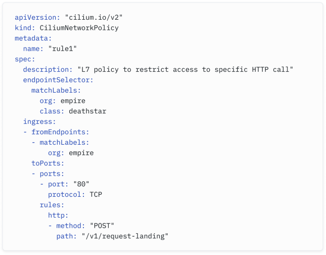

While Kubernetes Network Policies use `podSelector` , Cilium Network Policies use `endpointSelector` to determine which endpoints this applies to. The principle remains the same - the policy above will only apply to pods with the labels `org: empire` and `class: deathstar` .

在Kubernetes网络策略中使用`podSelector`，而在Cilium网络策略中使用`endpointSelector`来确定适用于哪些端点。原则保持不变 - 上述策略仅适用于带有标签`org:empire`和`class:deathstar`的Pod。

The policy will only permit HTTP traffic from pods with the `org: empire` label with the HTTP POST method and to the path `/v1/request-landing`.

该策略仅允许来自具有`org:empire`标签的Pod的HTTP流量，使用HTTP POST方法，并且目标路径为`/v1/request-landing`。

> While the CiliumNetworkPolicies offer advanced Layer 7 filtering, they do not replace a web-facing firewall or an advanced IDS/IPS. You will learn in a later section how to integrate Kubernetes with your firewalls.
>
> 虽然CiliumNetworkPolicies提供了高级的第7层过滤功能，但不能取代面向Web的防火墙或高级IDS/IPS。您将在后续部分了解如何将Kubernetes与您的防火墙集成。

# Where's my Load Balancer?

**我的负载均衡器在哪里?**

As a network engineer, you probably have deployed and used load balancers from the likes of F5 or Citrix. Load- balancing is, of course, an essential aspect of Kubernetes. 

作为网络工程师，你可能已经部署并使用过来自F5或Citrix等公司的负载均衡器。负载均衡当然是Kubernetes的一个重要方面。

A load balancer helps you achieve resilience and scale by making an application accessible through a single IP (often referred to as a "virtual IP" of a "virtual server") and by distributing the traffic across multiple servers (which we sometimes refer to as "real servers") while monitoring the health of servers through health checks. 

负载均衡器通过使应用程序通过单个IP（通常称为“虚拟服务器”的“虚拟IP”）可访问，并通过将流量分布到多个服务器（有时我们称之为“真实服务器”）来实现弹性和扩展性，同时通过健康检查监控服务器的健康状态。

In the traditional world, you have to manually add the IPs of the "real servers" fronted by the virtual server. As mentioned earlier, this model wouldn't work in Kubernetes - IPs are meaningless, and the churn of pods is so high that a manual approach would cancel out Kubernetes' auto- scaling benefits.

在传统世界中，你必须手动添加由虚拟服务器前端的“真实服务器”的IP。如前所述，这种模式在Kubernetes中不起作用 - IP是无意义的，并且Pod的变动如此之大，以至于手动方法将抵消Kubernetes的自动扩展优势。

[Kubernetes Services](https://kubernetes.io/docs/concepts/services-networking/service/) are primarily used for load balancing. Think of it as your virtual server, fronting your pods. 

[Kubernetes服务](https://kubernetes.io/docs/concepts/services-networking/service/)主要用于负载均衡。将其视为你的虚拟服务器，代表你的Pod。

Here is a sample Service configuration:

以下是一个示例服务配置：

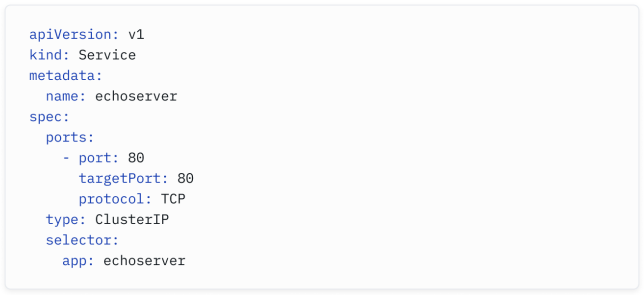

Note how we are using selectors again - remember when we talked about labels earlier and how we suggested they can help us identify a group of applications? Instead of manually adding the IPs of all the` echoserver` pods to our pool of virtual servers, all pods with the `app: echoserver` label will be automatically included, and traffic will be distributed across all pods.

注意我们再次使用选择器 - 还记得之前我们讨论过标签吗？我们建议标签可以帮助我们识别一组应用程序。现在，我们不需要手动将所有`echoserver` Pod的IP添加到我们的虚拟服务器池中，所有具有`app: echoserver`标签的Pod都将自动包括在内，并且流量将在所有Pod之间进行分配。

Your data center probably has internal load balancers (to load balance between internal clients and internal servers) and external-facing load balancers (to proxy and load balance traffic from external clients to internal servers). 

你的数据中心可能有内部负载均衡器（用于在内部客户端和内部服务器之间进行负载均衡）和外部负载均衡器（用于代理和负载均衡来自外部客户端的流量到内部服务器）。

In Kubernetes, we use different types of Services to distinguish between internal and external use cases.

在Kubernetes中，我们使用不同类型的服务来区分内部和外部用例。

## How do I load balance traffic within the cluster?

**如何对群集内的流量进行负载均衡？**

[ClusterIP](https://kubernetes.io/docs/concepts/services-networking/service/#type-clusterip) Services are used to expose the Service only within the cluster. As you can see in the kubectl command output below, the ClusterIP service receives a cluster- scoped virtual IP address.

[ClusterIP](https://kubernetes.io/docs/concepts/services-networking/service/#type-clusterip)服务用于仅在集群内部暴露服务。如下面的kubectl命令输出所示，ClusterIP服务接收到一个集群范围的虚拟IP地址。

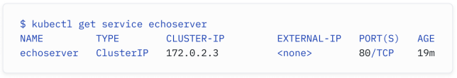

Note that while the CNI is responsible for assigning IPs to pods, the Kubernetes control plane is responsible for assigning virtual IPs to Services. 

注意，尽管CNI负责为Pod分配IP，但Kubernetes控制平面负责为服务分配虚拟IP。

ClusterIP is the default Service behavior if you don't specify the `type` in your Service definition. Once the ClusterIP Service is deployed, traffic will automatically be distributed across the pods in the cluster that match the selector (which is based on the labels of a pod).

如果在服务定义中不指定`type`，ClusterIP将是默认的服务行为。一旦部署了ClusterIP服务，流量将自动分布到与选择器匹配的集群中的Pod上（选择器基于Pod的标签）。

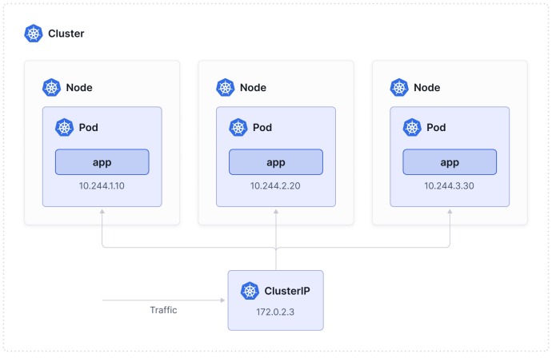

## How do I load balance traffic entering the cluster?

**如何对进入群集的流量进行负载均衡？**

This might be one of the most complex aspects of Kubernetes networking and, to do it justice, we would probably need to double the size of this eBook. To keep it brief, let?s focus on the core Kubernetes Services types that are designed to expose a Service into an external IP address: NodePort and LoadBalancer.

这确实是Kubernetes网络中最复杂的方面之一。要全面理解它，我们可能需要将这本电子书的内容翻倍。为了简洁起见，让我们重点关注设计用于将服务暴露到外部IP地址的核心Kubernetes服务类型：NodePort和LoadBalancer。

### NodePort Service

A [NodePort](https://kubernetes.io/docs/concepts/services-networking/service/#type-nodeport) Service lets users access your internal services by opening the same port on all nodes (with that port typically in the `30000- 32767` range). The nodes will act as NAT gateways and forward traffic to the pods. 

[NodePort](https://kubernetes.io/docs/concepts/services-networking/service/#type-nodeport)服务允许用户通过在所有节点上打开相同的端口（通常在`30000- 32767`范围内）来访问您的内部服务。节点将充当NAT网关，并将流量转发到Pod。

To make the node port available, Kubernetes sets up a cluster IP address, the same as if you had requested a ClusterIP Service. The difference is that NodePort also exposes a port on every node towards this IP. 

为了使节点端口可用，Kubernetes设置了一个集群IP地址，就像您请求了一个ClusterIP服务一样。区别在于NodePort还在此IP上向每个节点公开了一个端口。

Take a look at this output of a NodePort Service:

看一下NodePort服务的输出：

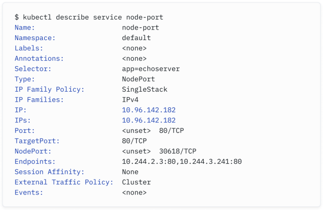

The node-port Service is deployed in the default namespace and uses the same selector as above (`app=echoserver` ).

node-port服务部署在默认命名空间中，并使用与上述相同的选择器（`app=echoserver`）。

> This particular Service is IPv4-only but note that Kubernetes and Kubernetes Services also support Dual Stack and IPv6- only (there's a section on IPv6 later in this eBook).
>
> 此特定服务仅支持IPv4，但请注意，Kubernetes和Kubernetes服务也支持双栈和仅IPv6（本电子书后面有关IPv6的部分）。

All nodes in the cluster will be listening on port `30618` for this particular service. 

集群中的所有节点将监听特定服务的端口`30618`。

Traffic arriving on the node on this port will be NATed to the healthy pods listening on the `targetPort` specified (`80`). 

到达节点上此端口的流量将被NAT到监听指定的`targetPort`（`80`）的健康Pod上。

Let's review a connectivity test from my external client into the cluster:

让我们审查一下从我的外部客户端到集群的连通性测试：

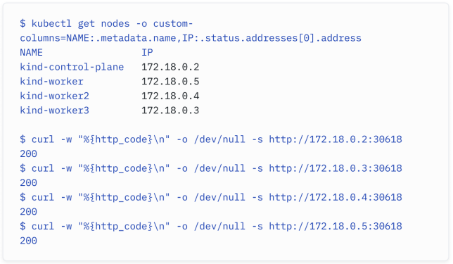

The first `kubectl` command returns the IP addresses of the nodes. The subsequent `curl` commands are executed to `http://$NODE_IP:$NODE_PORT` and only return the HTTP return code (with `200` highlighting a successful connection). The external client was able to access the internal service successfully.

这些命令很好地展示了如何使用kubectl获取节点的IP地址，然后使用curl命令来测试对NodePort服务的连接。返回的HTTP状态码为`200`表示连接成功。外部客户端成功访问了内部服务。

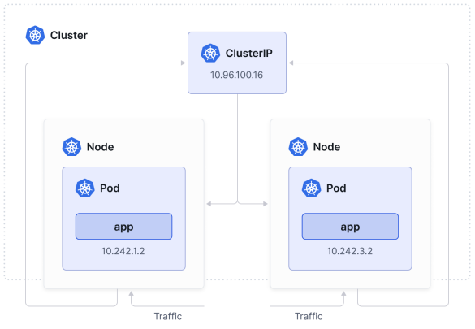

NodePort is simple but has limitations: users often run into issues with the constrained `30000-32767` port range, and NodePort does not natively offer load- balancing capabilities. Instead (or rather, alongside it), Kubernetes engineers tend to rely on services of the type LoadBalancer.

确实，NodePort虽然简单易用，但也存在一些限制：用户经常遇到`30000-32767`端口范围受限的问题，而且NodePort本身并不具备负载均衡功能。因此，Kubernetes工程师通常会使用LoadBalancer类型的服务来补充或替代NodePort。

### LoadBalancer Service

The [LoadBalancer](https://kubernetes.io/docs/concepts/services-networking/service/#loadbalancer) Service builds on top of the two previously mentioned Services. 

LoadBalancer服务在前面提到的两种服务的基础上构建而成。

When you create a LoadBalancer service, Kubernetes will communicate with the underlying provider's API to create an external load balancer (like AWS ELB, or Google Cloud Load Balancer), which is outside of the Kubernetes cluster. 

当您创建一个LoadBalancer服务时，Kubernetes将与底层提供商的API通信，以创建一个外部负载均衡器（如AWS ELB或Google Cloud负载均衡器），该负载均衡器位于Kubernetes集群之外。

The cloud provider will also allocate an external IP address and/or DNS name, which will be used by external clients to reach your internal service. The load balancer will then forward and distribute incoming traffic across the nodes. 

云提供商还会分配一个外部IP地址和/或DNS名称，外部客户端将使用这些来访问您的内部服务。然后，负载均衡器将转发和分发进入的流量到节点之间。

To implement a LoadBalancer Service, Kubernetes typically starts off by making changes that are equivalent to you requesting a NodePort Service by exposing the same ports across all cluster nodes. 

要实现LoadBalancer服务，Kubernetes通常会通过在所有集群节点上公开相同的端口来进行更改，这与您请求NodePort服务时的操作相同。

The load balancer will then forward and distribute incoming traffic across the nodes (helping you overcome the inherent NodePort limitations).

负载均衡器将转发和分发进入的流量到节点之间（帮助您克服了NodePort的固有限制）。

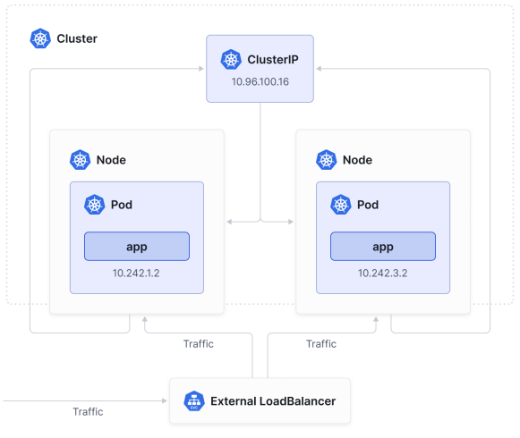

But the load balancer remains external to the cluster. In other words, deploying a LoadBalancer Service in Kubernetes is like sending an email to your hosting provider that says:

正如您所说，负载均衡器仍然是集群之外的。换句话说，在Kubernetes中部署LoadBalancer服务就像给您的托管提供商发送一封邮件，内容大致是：

> I would like to expose an internal application running on these servers. Could you please assign a public IP for this application and configure your external load balancer accordingly?
>
> 我想要暴露运行在这些服务器上的内部应用程序。您是否可以为这个应用程序分配一个公共IP，并相应地配置您的外部负载均衡器？

When using managed Kubernetes services, the cloud providers will deploy and configure that load balancing for you.

在使用托管的Kubernetes服务时，云提供商会为您部署和配置负载均衡。

If you're managing your own clusters on- premises, you can use Cilium instead to act as a load balancer network provider. Cilium can assign an external IP address (with the Load Balancer IP Address Management [LB-IPAM] feature) and then make this IP address accessible by BGP or ARP as you will learn in upcoming sections.

如果您正在自行管理本地集群，您可以使用Cilium作为负载均衡网络提供者。Cilium可以使用负载均衡器IP地址管理（LB-IPAM）功能分配外部IP地址，然后通过BGP或ARP使此IP地址可访问，您将在接下来的章节中了解更多相关信息。

> If you're interested in how load-balancing actually works in Kubernetes, the section "How do Load Balancing and NAT work under the hood? "will provide you with more information.
>
> 如果您对Kubernetes中负载均衡的工作原理感兴趣，可以阅读关于负载均衡和NAT的内部工作原理的部分，以获取更多信息。

# Where's my web proxy?

**我的网络代理在哪里？**

As a network engineer, you may have used web proxies, Layer 7 load balancers, and SSL VPN gateways - devices that let you load balance, route, and control HTTP/HTTPS traffic as it enters your network.

作为网络工程师，你可能使用过Web代理、第7层负载均衡器和SSL VPN网关——这些设备可以让你在进入网络时对HTTP/HTTPS流量进行负载均衡、路由和控制。

In Kubernetes, this role is often referred to as Ingress and was initially supported by the [Kubernetes Ingress API](https://kubernetes.io/docs/concepts/services-networking/ingress/) and, most recently, by the [Kubernetes Gateway API](https://gateway-api.sigs.k8s.io/). 

在Kubernetes中，这个角色通常被称为Ingress，并最初由[Kubernetes Ingress API](https://kubernetes.io/docs/concepts/services-networking/ingress/)支持，最近也被[Kubernetes Gateway API](https://gateway-api.sigs.k8s.io/)支持。

Ingress exposes HTTP and HTTPS routes from outside the cluster to services within the cluster. Traffic routing is controlled by rules defined on the Ingress resource. 

Ingress将来自集群外部的HTTP和HTTPS路由暴露给集群内部的服务。流量路由由在Ingress资源上定义的规则控制。

In order for the Ingress resource to work, the cluster must have an Ingress Controller running. 

为了使Ingress资源正常工作，集群必须运行一个Ingress Controller。

One of the benefits of Cilium is that it is the only CNI that can also act as an ingress controller. This means you don't need to install another tool to support the Ingress functionality. Let's review a sample Cilium Ingress configuration.

Cilium的一个好处是它是唯一一个既可以作为CNI又可以充当Ingress控制器的CNI。这意味着你不需要安装另一个工具来支持Ingress功能。让我们来看一下一个样例Cilium Ingress配置。

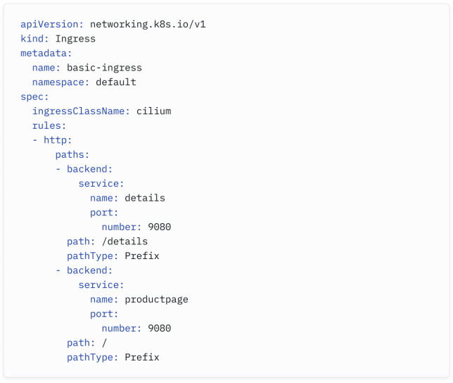

By applying a manifest such as the one above, the Cilium ingress controller would create a Service of type LoadBalancer. 

通过应用类似上面的清单，Cilium Ingress控制器将创建一个类型为LoadBalancer的Service。

The route above would direct HTTP requests for the path `/details` to the `details` Service, and `/` to the `productpage` Service. Assuming $HTTP_INGRESS is the IP address assigned to the Service, you can access the details Service from outside the cluster, as shown in the output below:

上面的路由将把路径为`/details`的HTTP请求转发到`details`服务，将`/`的请求转发到`productpage`服务。假设$HTTP_INGRESS是分配给Service的IP地址，你可以从集群外部访问details服务，如下面的输出所示：

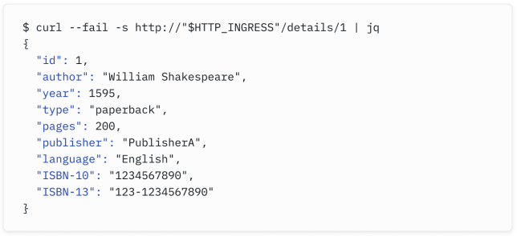

You can see from this non- exhaustive list on the [Kubernetes Ingress Controllers](https://kubernetes.io/docs/concepts/services-networking/ingress-controllers/) page that many implementations of the Ingress API exist. The challenge with Ingress API was that every Ingress implementation became different from one to another. It made changing Ingresses very difficult: migrating from one Ingress to another would be like copying your Juniper configuration onto your Cisco router and expecting good results. 

你可以从[Kubernetes Ingress Controllers](https://kubernetes.io/docs/concepts/services-networking/ingress-controllers/)页面的这个非详尽列表中看到，存在许多Ingress API的实现。Ingress API的挑战在于，每个Ingress实现都有所不同。这使得更改Ingress非常困难：从一个Ingress迁移到另一个Ingress就像将你的Juniper配置复制到你的Cisco路由器上并期望得到良好的结果一样。

To address this shortcoming, the Ingress API is being superseded by Gateway API. Gateway API is portable and inter- compatible, meaning that you can easily migrate from one Gateway API implementation to another. 

为了解决这个缺点，Ingress API正在被Gateway API取代。Gateway API是可移植和相互兼容的，这意味着你可以轻松地从一个Gateway API实现迁移到另一个。

Again, Cilium natively supports Gateway API; removing the need to install another tool for ingress routing. 

同样，Cilium原生支持Gateway API；无需安装其他工具进行入口路由。

The equivalent Gateway API configuration to the one above would be the one below:

与上面的等价Gateway API配置如下：

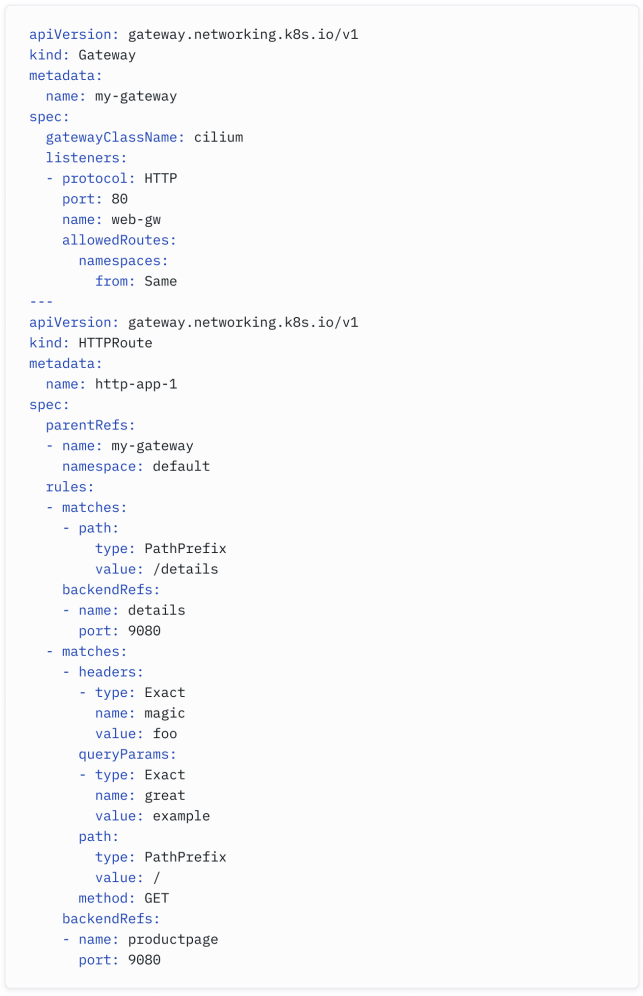

One of the other advantages of using Gateway API is that it expands beyond just the HTTP path- based routing use case that Ingress API was based upon. 

使用Gateway API的另一个优点是，它不仅仅局限于Ingress API所基于的基于HTTP路径的路由用例。

Gateway API supports a multitude of routing capabilities, including traffic splitting, URL redirection, path rewrites, mirroring, HTTP request/response manipulation, TLS termination and passthrough, and other capabilities that were only possible in Ingress through custom annotations.

Gateway API支持多种路由功能，包括流量分流、URL重定向、路径重写、镜像、HTTP请求/响应操作、TLS终止和透传，以及其他在Ingress中只能通过自定义注释实现的功能。

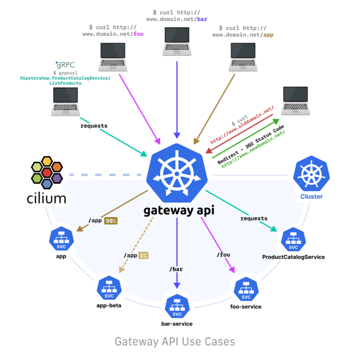

# How can I connect my cluster to existing networks?

**如何将集群连接到现有网络？**

There are multiple ways to connect your cluster to your existing network, which might depend on the routing mode selected ("native" or "encapsulation"), how the network is configured, which level of resilience and traffic engineering is expected, etc. 

有多种方法可以将你的集群连接到现有网络，这可能取决于所选择的路由模式（本地还是封装），网络的配置方式，期望的容错性和流量工程水平等。

Network engineers might be pleased to know one of the options to connect Kubernetes clusters to the rest of the network is through our beloved Border Gateway Protocol (BGP). 

网络工程师可能会高兴地知道，将Kubernetes集群连接到网络的选项之一是通过我们钟爱的边界网关协议（BGP）。

BGP support in Kubernetes comes in different forms. While it is possible to install and manage your own BGP daemons in your cluster to connect your cluster to the rest of the network, this presents additional complexity. The more elegant method is to use Cilium's built-in support for BGP. 

Kubernetes中的BGP支持有不同的形式。虽然可以在集群中安装和管理自己的BGP守护程序来将集群连接到网络的其余部分，但这会增加额外的复杂性。更优雅的方法是使用Cilium内置的BGP支持。

Cilium lets you build a BGP peering session over IPv4 or IPv6 and advertises the LoadBalancer Service IPs or the PodCIDR ranges to the rest of the network. Peering sessions are typically established with a Top- of- Rack (ToR) device.

Cilium允许你在IPv4或IPv6上建立BGP对等会话，并将负载均衡器服务IP或PodCIDR范围广播给网络的其余部分。对等会话通常是与顶部交换机（ToR）设备建立的。

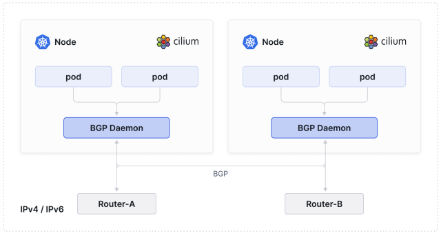

Cilium supports the most commonly used BGP features - MD5- based session authentication, customization of BGP timers, communities, local preferences, graceful restart, etc... 

Cilium支持最常用的BGP功能，如基于MD5的会话身份验证、BGP计时器的定制、社区、本地首选项、优雅重启等。

Configuring it is simple - simply apply a CiliumBGPPeeringPolicy like the following:

配置它很简单 - 只需应用一个类似以下的CiliumBGPPeeringPolicy即可：

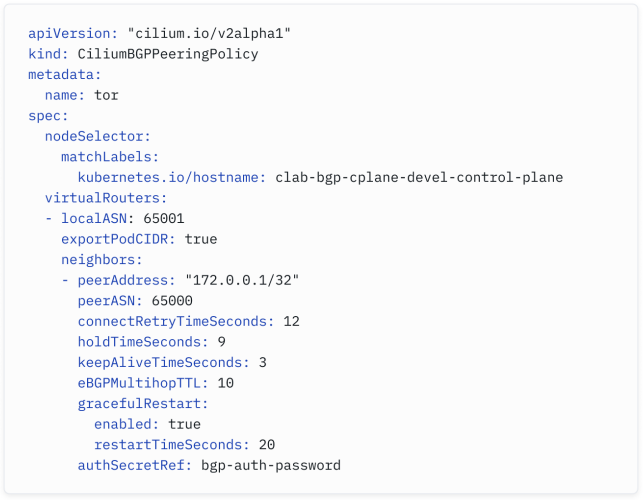

Assuming your peer is a Cisco device, it may have a BGP configuration such as:

如果你的对等方是一台思科设备，它可能有如下的BGP配置：

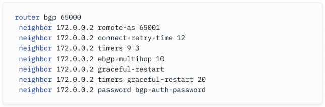

Once the peering session is established and routes advertised and exchanged, the rest of the network can access applications hosted in the Kubernetes cluster.

一旦对等会话建立并且路由被广播和交换，网络的其余部分就可以访问托管在Kubernetes集群中的应用程序。

You can even use the Cilium CLI to verify that peering sessions have been established and that routes are being advertised. Here is another example:

你甚至可以使用Cilium CLI来验证对等会话是否已建立，并且路由是否被广播。以下是另一个示例：

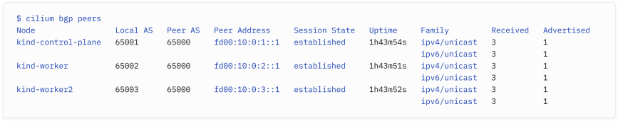

## I don't have any BGP-capable device in my existing network. Is there another way for me to access my Kubernetes services?

**我的现有网络中没有任何支持 BGP 的设备。有没有其他方法让我访问 Kubernetes 服务？**

If you would rather not use BGP or if you don't have any BGP- capable device in your network, you can advertise the networks locally, over Layer 2, using another protocol known to all network engineers: Address Resolution Protocol (ARP). 

如果你不想使用BGP，或者你的网络中没有任何支持BGP的设备，你可以使用另一种所有网络工程师都熟悉的协议，在第二层本地广播网络上广播网络：地址解析协议（ARP）。

If you have local clients on the network that need access to a Service, they need to know which MAC address to send their traffic to. Cilium leverages ARP to announce the MAC address associated with a particular IP. 

如果网络上有需要访问服务的本地客户端，它们需要知道将其流量发送到哪个MAC地址。Cilium利用ARP来宣布与特定IP关联的MAC地址。

Let's walk through an example. In the image below, our client is on the same network as the Kubernetes LoadBalancer Service. In this case, you don?t need BGP; the client simply needs to understand which MAC address is associated with the IP address of our service so that it knows to which host it needs to send the traffic.

让我们通过一个例子来说明。在下面的图像中，我们的客户端位于与Kubernetes负载均衡器服务相同的网络上。在这种情况下，你不需要BGP；客户端只需要了解哪个MAC地址与我们服务的IP地址关联，这样它就知道将流量发送到哪个主机。

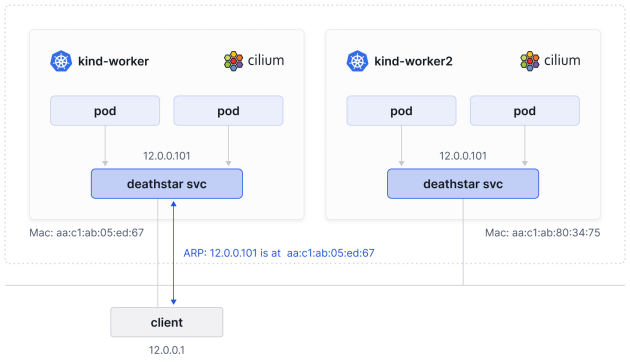

Cilium can reply to ARP requests from clients for LoadBalancer IPs and enable clients to access their services. In this instance, the client (with an IP of `12.0.0.1`) wants to access a Service at `12.0.0.101` and sends an ARP request as a broadcast asking, "Who has 12.0.0.101? Tell 12.0.0.1".

Cilium可以响应来自客户端对负载均衡器IP的ARP请求，并使客户端能够访问它们的服务。在这种情况下，客户端（具有IP `12.0.0.1`）希望访问`12.0.0.101`处的服务，并发送一个ARP请求作为广播询问：“谁有12.0.0.101？告诉12.0.0.1”

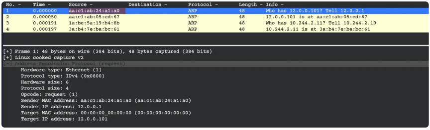

The Cilium node will reply to the client with its MAC address ("`12.0.0.101 is at aa:c1:ab:05:ed:67`") and the client will be able to access the service.

Cilium节点将使用其MAC地址回复客户端（“`12.0.0.101 is at aa:c1:ab:05:ed:67`”），客户端将能够访问该服务。

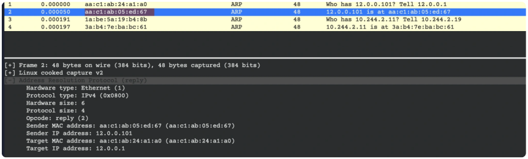

The feature is often referred to as "Layer 2 (L2) Announcements" and is typically for very small environments or home labs as BGP?s flexibility and scalability characteristics are better suited for data center networks.

这个功能通常被称为“第二层（L2）通告”，通常用于非常小的环境或家庭实验室，因为BGP的灵活性和可扩展性特征更适合数据中心网络。

# How do I connect my cluster with an external firewall?

**如何将群集与外部防火墙连接？**

The applications running on your Kubernetes cluster will eventually need to access external resources, including data on the Internet. Of course, you will want to ensure your applications are protected and that your Internet or external-facing firewall controls Internet- bound traffic from the cluster. 

您的Kubernetes集群上运行的应用程序最终需要访问外部资源，包括互联网上的数据。当然，您希望确保您的应用程序受到保护，并且您的互联网或面向外部的防火墙控制来自集群的互联网流量。

However, the challenge when connecting your traditional firewall (from vendors such as Palo Alto Networks, CheckPoint, or Cisco) is that they typically have little to no awareness of Kubernetes objects like namespace or labels. When a packet leaves the cluster, its source IP is typically masqueraded (or source NATed) to that of the node it was on. 

然而，连接传统防火墙（如Palo Alto Networks、CheckPoint或Cisco等厂商）的挑战在于，它们通常几乎不了解Kubernetes对象，比如命名空间或标签。当数据包离开集群时，其源IP通常会被伪装（或源NAT）为其所在节点的IP。

Your firewall will see that traffic coming in but will have no idea where the traffic originates - if it?s from a particular pod or the node itself. To address this, CNIs like Cilium support a feature called `Egress Gateway`. 

您的防火墙将看到进入的流量，但不知道流量的来源 - 它是否来自特定的Pod还是节点本身。为了解决这个问题，像Cilium这样的CNI支持一个称为`Egress Gateway`的功能。

Egress Gateway is essentially Kubernetes-Aware Source- NAT: for example, for pods in a particular namespace, we can force the traffic to exit via a certain interface and to be NATed with a specific IP, enabling the firewall to apply a rule accordingly. 

Egress Gateway本质上是Kubernetes感知源NAT：例如，对于特定命名空间中的Pod，我们可以强制流量通过特定接口退出，并使用特定IP进行NAT，从而使防火墙能够相应地应用规则。

Let's take a look at a sample `CiliumEgressGatewayPolicy`:

让我们看一下一个示例的`CiliumEgressGatewayPolicy`：

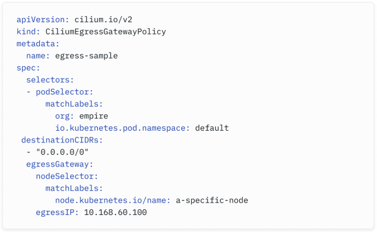

What the policy above achieves is the following: when pods with the `org: empire` label and located in the `default` namespace send traffic outside the cluster, the traffic will exit via a node with a specific label, and the packets will be source- NAT with `10.168.60.100`, which should be an IP associated with a network interface on this particular node.

上述策略的实现如下：当位于`default`命名空间中并带有`org: empire`标签的Pod发送流量到集群外时，流量将通过具有特定标签的节点出去，并且数据包将使用`10.168.60.100`进行源NAT，这是与指定节点上的网络接口关联的IP。

You now know traffic originating from your `org: empire` pods will have the source IP `10.168.60.100`, and you can configure the appropriate security rules in your firewalls based on that IP.

现在您知道来自您的`org: empire` Pod 的流量将具有源IP `10.168.60.100`，您可以根据该IP在防火墙中配置适当的安全规则。

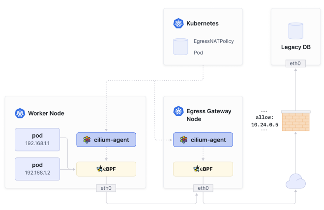

The only drawback with this model is that the Egress node becomes a single point of failure. For this reason, Isovalent?s enterprise edition of Cilium includes Egress Gateway High Availability (HA), which supports multiple egress nodes. The nodes acting as egress gateways will then load- balance traffic in a round-robin fashion and provide fallback nodes in case one or more egress nodes fail.

这个模型的唯一缺点是出口节点成为了单点故障。因此，Isovalent 的 Cilium 企业版包括 Egress Gateway 的高可用性 (HA)，支持多个出口节点。充当出口网关的节点将以轮询方式负载均衡流量，并提供备用节点，以防一个或多个出口节点发生故障。

# How do internal Load Balancing and NAT work under the hood?

**内部负载平衡和 NAT 是如何工作的？**

In the traditional networking world, performance is dictated by many factors - the configuration and the choice of network protocols, the network interface cards, the underlying hardware, etc... 

传统的网络世界中，性能受到许多因素的影响 - 配置和选择网络协议、网络接口卡、底层硬件等等...

In Kubernetes, all these factors still matter (the software has to run on some hardware, after all), but one decision engineers must make as their Kubernetes environment grows is whether to use [kube-proxy](https://kubernetes.io/docs/concepts/overview/components/#kube-proxy). 

在 Kubernetes 中，所有这些因素仍然很重要（毕竟软件必须在某些硬件上运行），但随着 Kubernetes 环境的增长，工程师必须做出的一个决定是是否使用 kube-proxy。

By default, kube- proxy is installed on each node, ensuring network traffic flows from services to the appropriate pods. When a new service or endpoint is created, it abstracts the underlying pod IPs, allowing other services to communicate using the service?s virtual IP address.

默认情况下，kube-proxy 安装在每个节点上，确保网络流量从服务流向适当的 Pod。当创建新服务或端点时，它抽象出底层的 Pod IP，允许其他服务使用服务的虚拟 IP 地址进行通信。

Despite what its name might suggest, kube-proxy is not an actual proxy - rather, it watches the Kubernetes control plane to then ensure that rules on the underlying operating system packet filtering are up-to- date. It manages network rules necessary for routing traffic, including Network Address Translation (NAT) when required, to ensure packets reach their intended destinations. The problem is that kube- proxy was originally based on a 25- year- old technology ([iptables](https://en.wikipedia.org/wiki/Iptables)), which wasn't designed for the [churn of Kubernetes](https://isovalent.com/blog/post/why-replace-iptables-with-ebpf/). 

尽管其名称可能暗示了什么，但 kube-proxy 实际上不是一个真正的代理 - 相反，它监视 Kubernetes 控制平面，然后确保底层操作系统的数据包过滤规则是最新的。它管理路由流量所需的网络规则，包括在需要时进行网络地址转换（NAT），以确保数据包到达其预期目的地。问题在于，kube-proxy 最初基于一个 25 年前的技术（iptables），这种技术并不是为 Kubernetes 的变化而设计的。

The best comparison I can come up with is this: imagine walking into a data center today and installing a Cisco PIX to secure your AI workloads.

我能想到的最好的比较是这样的：想象一下，今天走进一个数据中心，安装一个 Cisco PIX 来保护您的 AI 工作负载。

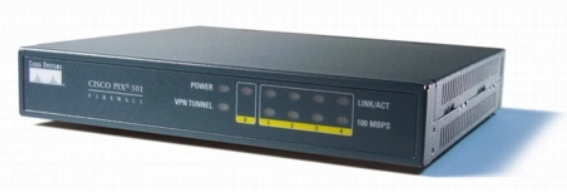

Yikes.  天哪。

The main challenge with iptables' performance is that it relies on a sequential algorithm. Iptables goes through each rule individually in the table to match rules against observed traffic. This means that the time taken scales linearly with each added rule, and performance strain quickly becomes apparent as more services and endpoints are added. A packet has to traverse each rule to find a match, introducing latency and instability.

iptables 性能的主要挑战在于它依赖于顺序算法。Iptables 逐个检查表中的每个规则，以匹配观察到的流量。这意味着随着每个添加的规则，所花费的时间呈线性增加，随着更多的服务和端点的添加，性能压力很快就会显现出来。数据包必须遍历每个规则才能找到匹配项，引入了延迟和不稳定性。

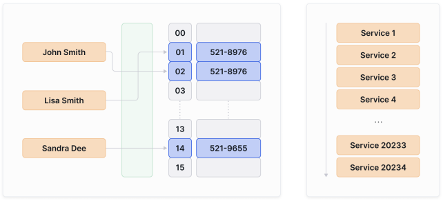

While Kubernetes users can now use kube- proxy in the better- performing ipvs mode, it is still reliant on netfilter. The alternative is to use Cilium?s eBPF- based kube-proxy replacement. 

尽管 Kubernetes 用户现在可以在性能更好的 ipvs 模式下使用 kube-proxy，但它仍然依赖于 netfilter。另一种选择是使用 Cilium 的基于 eBPF 的 kube-proxy 替代方案。

[eBPF](https://ebpf.io/) is a revolutionary Linux technology that you may have come across. You don't have to know about eBPF to install and operate Cilium - after all, most of us network engineers operate networks without understanding how ASICs are programmed - but a brief primer doesn't hurt. 

[eBPF](https://ebpf.io/) 是一项革命性的 Linux 技术，你可能已经听说过。你不必了解 eBPF 就可以安装和操作 Cilium - 毕竟，我们大多数网络工程师在不了解如何编程 ASIC 的情况下操作网络 - 但简要介绍也无妨。

eBPF is best known for the ability to safely run virtual networking and security programs within the Linux kernel. It resembles the virtual network function (VNF) concept in Telco networks or service insertion for VMware NSX or Cisco ACI users.

eBPF 最为人所知的是能够在 Linux 内核中安全地运行虚拟网络和安全程序。它类似于电信网络中的虚拟网络功能（VNF）概念，或者适用于 VMware NSX 或 Cisco ACI 用户的服务插入功能。

Here is another comparison: our beloved [Cisco Catalyst 6500](https://www.cisco.com/c/en/us/support/switches/catalyst-6500-series-switches/series.html) switches were initially used purely for switching packets. Eventually we started inserting dedicated line cards in the chassis to support routing, security, and load- balancing functionalities. You can think of eBPF- based tools like Cilium as service modules you can insert into your Linux kernel. 

再举一个比较：我们所钟爱的[Cisco Catalyst 6500](https://www.cisco.com/c/en/us/support/switches/catalyst-6500-series-switches/series.html)交换机最初仅用于交换数据包。最终，我们开始在机箱中插入专用线卡，以支持路由、安全和负载平衡功能。你可以将基于 eBPF 的工具（如 Cilium）想象成可以插入到你的 Linux 内核中的服务模块。

Cilium provides a kube- proxy replacement that relies on efficient eBPF hash tables. eBPF maps are the mechanism in the Linux kernel used by eBPF programs to store and retrieve data efficiently.

Cilium 提供了一个依赖于高效的 eBPF 哈希表的 kube-proxy 替代方案。eBPF 映射是 Linux 内核中由 eBPF 程序用于高效存储和检索数据的机制。

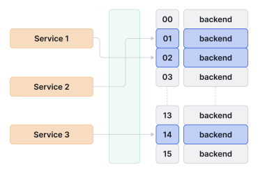

Cilium's eBPF kube- proxy replacement benefits are particularly evident at scale. While iptables struggles with latency as the number of microservices grows, you can see the efficiency of eBPF in the performance benchmarking graphic below.

Cilium 的基于 eBPF 的 kube-proxy 替代方案在规模化场景下的好处尤为明显。当微服务数量增加时，iptables 的延迟会增加，而你可以在下面的性能基准图表中看到 eBPF 的效率。

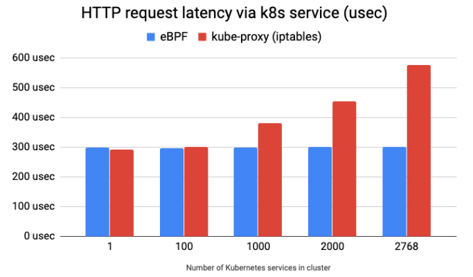

# How do I manage and troubleshoot my network?

**如何管理我的网络并排除故障？**

In the traditional networking world, network engineers have relied on trusted tools and systems to troubleshoot. Here is a non- exhaustive list of tools you may have in your toolbox and their equivalent for Kubernetes and Cilium users:

在传统的网络领域中，网络工程师依赖于可靠的工具和系统进行故障排除。以下是一个非详尽的工具列表，以及它们在 Kubernetes 和 Cilium 用户中的等价物：

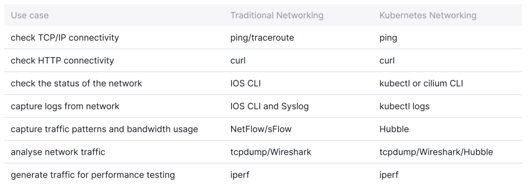

In your network, you may have run some of the connectivity tooling commands from your routers and devices or straight from your terminal. In your Kubernetes cluster, you may need to deploy a monitoring pod for troubleshooting purposes. I recommend the Kubernetes networking troubleshooting container [netshoot](https://github.com/nicolaka/netshoot) as it includes tools such as tcpdump and iperf amongst many others.

在你的网络中，你可能会从路由器和设备或直接从终端运行一些连接工具命令。在你的 Kubernetes 集群中，你可能需要部署一个监控 Pod 进行故障排除。我推荐使用 Kubernetes 网络故障排除容器 [netshoot](https://github.com/nicolaka/netshoot)，因为它包含了诸如 tcpdump 和 iperf 等许多工具。

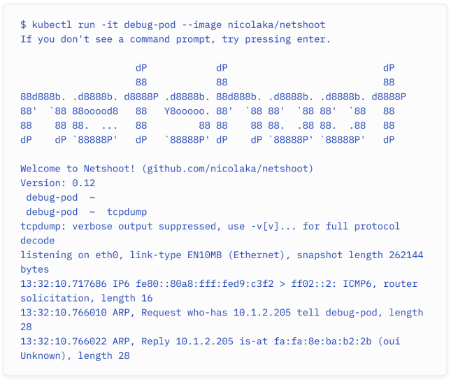

Even better, you can use `kubectl debug` to deploy an ephemeral container in an existing pod to debug networking issues (remember they share the same networking stack):

更好的是，你可以使用 `kubectl debug` 命令在现有的 Pod 中部署一个临时容器，用于调试网络问题（请记住它们共享相同的网络栈）。

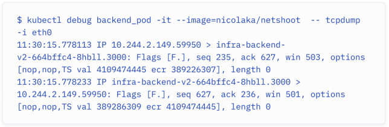

# How can I monitor and visualize network traffic?

**如何监控和可视化网络流量？**

In your traditional network, you may use Netflow/sFlow to collect and export network flows in the following format:

在传统网络中，你可能使用 Netflow/sFlow 来收集和导出网络流量，格式如下：

Your NetFlow collector might then be able to represent the flows in a graphical interface and build a visual representation of who's talking to whom. To do the same in Kubernetes, you'd typically use Hubble. 

你的NetFlow收集器可能能够在图形界面中表示流量，并构建一个显示谁在与谁通信的可视化表示。在Kubernetes中实现相同功能，通常会使用Hubble。

Hubble is the network observability tool that comes with Cilium - think of it as a combination of NetFlow and Wireshark. By using eBPF, Hubble can hook into the network and extract networking data. Hubble comes with its own CLI and UI. 

Hubble是随Cilium提供的网络可观测性工具——可以将其视为NetFlow和Wireshark的结合体。通过使用eBPF，Hubble可以钩入网络并提取网络数据。Hubble自带其专用的CLI和UI。

You can use the CLI to observe all the flows in the cluster, with the option to use filters to, for example, only see traffic from the `tiefighter` pod in the `endor`namespace.

你可以使用CLI观察集群中的所有流量，还可以使用过滤器选项，例如，只查看`endor`命名空间中 `tiefighter` Pod 的流量。

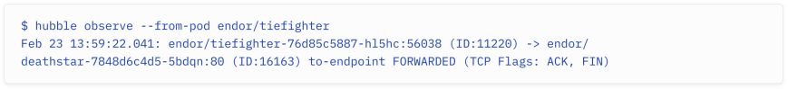

The Hubble UI lets you visualize traffic in a Kubernetes cluster as a service map. The example below shows three pod identities in the endor namespace:
Hubble UI允许你将Kubernetes集群中的流量可视化为服务地图。下面的示例显示了`endor`命名空间中的三个Pod标识：

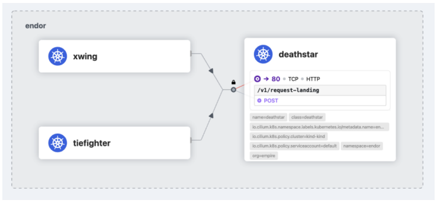

Both `xwing` and `tiefighter` pods are trying to access the Deathstar. Note the granularity of the flow information you get from Hubble. You can see that the traffic was HTTP over the `/v1/request-landing` HTTP path, using the POST method. 

`xwing`和`tiefighter` Pod都试图访问Deathstar。注意从Hubble获取的流量信息的细粒度。你可以看到流量是通过`/v1/request-landing` HTTP路径进行的HTTP通信，使用的是POST方法。

While the open source edition of Cilium includes a standard version of Hubble, the enterprise edition of Cilium includes an `advanced enterprise edition of Hubble`, with multi-tenant self- service access, historical flow and analytics data, and a built-in network policy editor (described in more details at the end of the next section).

虽然Cilium的开源版本包括标准版本的Hubble，但Cilium的企业版包括一个`高级企业版的Hubble`，具有多租户自助访问、历史流量和分析数据，以及内置的网络策略编辑器（在下一节末尾更详细地描述）。

# How do I start securing my cluster?

**如何开始保护我的集群？**

Clusters are typically deployed without network policies: as is the case in traditional networking, we are all often guilty of bolting security on later. 

集群通常在没有网络策略的情况下部署：就像传统网络一样，我们经常在后期添加安全性。

Deploying network policies without disrupting the applications running on the cluster presents a couple of challenges for operators: 1) How do I deploy network policies in a transparent manner without breaking the cluster? and 2) How do I even know which security rules to enforce? 

在不干扰集群中运行的应用程序的情况下部署网络策略对操作者来说存在一些挑战：1）如何以透明的方式部署网络策略而不会破坏集群？2）我如何知道要执行哪些安全规则？

The first challenge can be addressed by selecting the Cilium Network Policy enforcement mode. In the `default` enforcement mode, endpoints start without restriction but as soon as a rule matches, traffic has to be explicitly allowed or traffic will be dropped. In the `never` enforcement mode, all traffic is permitted. This is an audit- only mode you can run to see what the policy might catch before enforcing it.

第一个挑战可以通过选择Cilium网络策略执行模式来解决。在`default`执行模式中，端点在没有限制的情况下启动，但是一旦规则匹配，流量必须明确允许，否则流量将被丢弃。在`never`执行模式中，允许所有流量。这是一个审计模式，您可以在强制执行之前运行以查看策略可能捕获到的内容。

> The more security- savvy network engineers that want strict, or zero trust, network security from the start could also set the policy enforcement mode to al ways in which Cilium will block all traffic unless there is a Network Policy explicitly allowing it.
>
> 更注重安全的网络工程师可以从一开始就将策略执行模式设置为`always`，在这种模式下，Cilium将阻止所有流量，除非有网络策略明确允许。

The second challenge can be tackled in various manners. You can rely on the developers to tell you how the micro- services are inter- connected, over which ports they are communicating, which API they're using, etc... The problem is that it can be difficult to understand the developer's intent. Let?s face it - most developers don?t always know how micro- services are interconnected! 

第二个挑战可以通过各种方式解决。你可以依赖开发人员告诉你微服务如何相互连接，它们使用哪些端口进行通信，使用哪个API等等。问题在于理解开发人员的意图可能很困难。面对现实吧——大多数开发人员并不总是知道微服务是如何相互连接的！

Alternatively, you could deploy Hubble, observe the traffic, and create network policies based on the traffic. This works fine although it can be time- consuming. 

另一种方法是部署Hubble，观察流量，并根据流量创建网络策略。这虽然有效，但可能会耗费时间。

This is an area where Isovalent is here to help. Firstly, Isovalent provides a free, online [Network Policy Editor](https://editor.networkpolicy.io/?id=zY7xvsvHZPRFxbXR) designed to ease the cognitive overhead of developing network policies. It lets you visualize policies, allowing users to easily create policies before downloading them in YAML files. 

这正是Isovalent要帮助的领域。首先，Isovalent提供了一个免费的在线[网络策略编辑器](https://editor.networkpolicy.io/?id=zY7xvsvHZPRFxbXR)，旨在减轻开发网络策略的认知负担。它让你可视化策略，让用户在下载为YAML文件之前轻松创建策略。

Additionally, Isovalent's Enterprise Edition of Cilium includes an advanced enterprise Hubble view that is designed to greatly simplify and accelerate network policy generation.

此外，Isovalent的Cilium企业版还包括一个专门设计的高级企业Hubble视图，旨在极大地简化和加速网络策略生成。

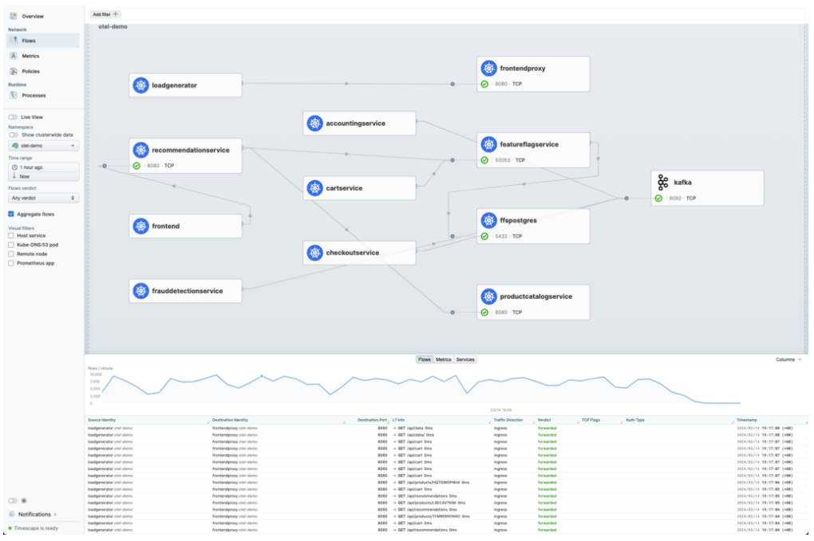

It lists all the flows in the cluster (which can be filtered by namespace) and by clicking on a particular flow, you can automatically create a Cilium Network Policy based on this particular flow. The Network Policy can then be downloaded as a YAML file and applied to the cluster.

它列出了集群中的所有流量（可以按命名空间进行过滤），通过点击特定的流量，您可以自动创建一个基于该特定流量的Cilium网络策略。然后，可以将网络策略下载为YAML文件，并应用于集群。

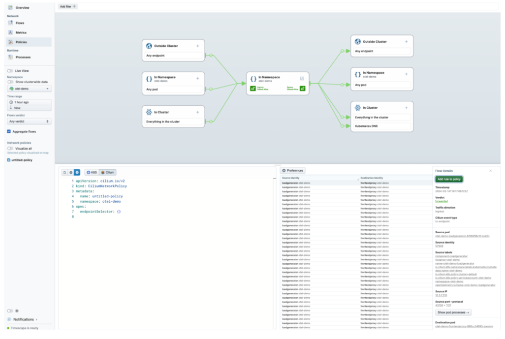

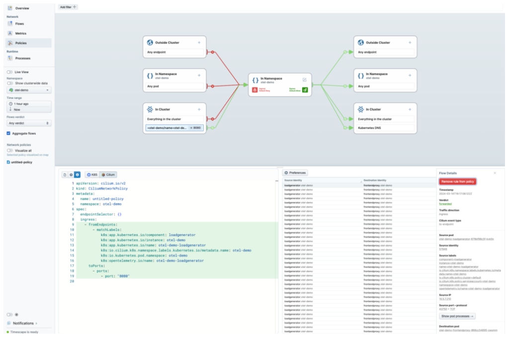

# How do I encrypt the traffic in my cluster?

**如何加密群集中的流量？**

Encrypting data in transit is a common requirement. Whether over public networks or even within your data centers, you probably have considered how to protect your data and ensure you meet certain regulatory requirements.

在传输数据时进行加密是一个常见的要求。无论是在公共网络上还是在您的数据中心内部，您可能都考虑过如何保护您的数据，并确保符合某些监管要求。

Over the Internet, between data centers, or even within a network, you may have used IPsec- based VPNs to encrypt the traffic between two different sites. Those who can afford the specialized crypto hardware may have used technologies such as MACsec (defined by the IEEE 802.1AE standard) to encrypt traffic on Ethernet links. 

在互联网上、数据中心之间，甚至是在网络内部，您可能已经使用过基于IPsec的VPN来加密两个不同站点之间的流量。那些能够承担得起专门的加密硬件的人可能已经使用了诸如MACsec（由IEEE 802.1AE标准定义）等技术来加密以太网链路上的流量。

The requirement can also exist in Kubernetes and might be even more common, given Kubernetes clusters are often deployed on shared hardware in cloud data centers. Cilium's Transparent Encryption feature set offers two options for encrypting traffic between pods on different nodes (or even between clusters): IPsec and WireGuard.

在Kubernetes中，这种需求也可能存在，并且可能更为普遍，因为Kubernetes集群通常部署在云数据中心的共享硬件上。Cilium的透明加密功能集提供了两种选项，用于在不同节点上的Pod之间（甚至在集群之间）加密流量：IPsec和WireGuard。

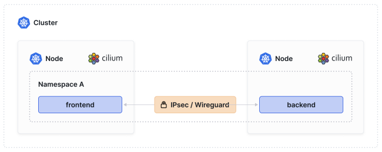

The IPsec method lets you choose the algorithm and cipher and manage the keys (just as you would do when setting IPsec between two VPN endpoints in your network), while the WireGuard option is opinionated: it leverages very robust cryptography and does not let the user choose ciphers and protocols. 

IPsec方法允许您选择算法和密码，并管理密钥（就像在网络中设置两个VPN终端之间的IPsec时一样），而WireGuard选项是一种固执己见的选择：它利用非常强大的加密技术，不允许用户选择密码和协议。

Both methods ensure that traffic between pods is encrypted as long as pods are located on different nodes.

两种方法都确保只要Pod位于不同的节点上，Pod之间的流量就会被加密。

# How do we connect clusters together?

**如何将集群连接在一起？**

As a network engineer, you have probably been tasked to design resilient and highly resilient solutions across multiple sites. You may also have had to connect both networks together, often over a Layer 3 network, and use an intersite control plane such as BGP EVPN VXLAN to distribute network information. You may have also implemented some form of load balancing across multiple sites. You would have had to consider how to enforce consistent security policy across multiple sites. 

作为网络工程师，您可能被要求设计跨多个站点的弹性和高度弹性的解决方案。您可能还必须将两个网络连接在一起，通常是通过Layer 3网络，并使用诸如BGP EVPN VXLAN之类的站点间控制平面来分发网络信息。您可能还实施了一些形式的跨多个站点的负载均衡。您必须考虑如何在多个站点之间强制执行一致的安全策略。

In Kubernetes, these challenges remain - in a multi- cluster topology, you have multiple clusters located across different zones for resiliency and high availability. While it might be relatively trivial to set up IP connectivity between the clusters, they would have no awareness of each other's objects, such as pods, services, namespaces, labels, and other metadata. 

在Kubernetes中，这些挑战仍然存在-在多集群拓扑中，您有多个集群位于不同的区域以实现弹性和高可用性。尽管在集群之间建立IP连接可能相对容易，但它们不会意识到彼此的对象，如Pod、服务、命名空间、标签和其他元数据。

As we've seen, network policies and load balancing often rely on such metadata. Therefore, load- balancing across clusters or applying security policies across multiple clusters is not possible in a standard Kubernetes cluster implementation.

正如我们所见，网络策略和负载均衡通常依赖于这些元数据。因此，在标准的Kubernetes集群实现中，跨集群进行负载均衡或应用安全策略是不可能的。

This is where you might need a multi- cluster solution like Cilium Cluster Mesh. 

这就是您可能需要像Cilium Cluster Mesh这样的多集群解决方案的地方。

Cilium Cluster Mesh addresses these requirements by federating multiple Cilium instances on different clusters. Cluster Mesh automatically discovers services across all meshed clusters and load balances the traffic effectively. 

Cilium Cluster Mesh通过在不同的集群上联合多个Cilium实例来解决这些要求。Cluster Mesh自动发现所有网格化集群中的服务，并有效地负载均衡流量。

One of the main use cases for using Cluster Mesh is High Availability. This use case includes operating Kubernetes clusters in multiple regions or availability zones and running the replicas of the same services in each cluster. Traffic will by default be load- balanced to all endpoints across clusters. When all endpoints in a given cluster fail, traffic will be forwarded to the remaining endpoints in other clusters.

使用Cluster Mesh的主要用例之一是高可用性。这个用例包括在多个区域或可用性区域操作Kubernetes集群，并在每个集群中运行相同服务的副本。流量将默认负载均衡到所有集群中的端点。当给定集群中的所有端点失败时，流量将被转发到其他集群中的剩余端点。

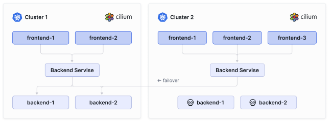

With Cilium Cluster Mesh, you can enforce network policy to workloads spanning multiple clusters.

使用Cilium Cluster Mesh，您可以强制执行跨多个集群的工作负载的网络策略。

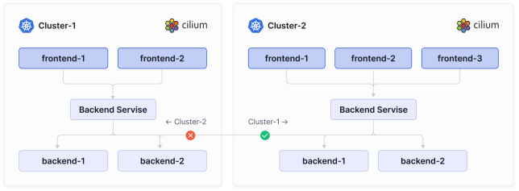

In the example above, the frontend pods on cluster- 1 are allowed to connect to backend pods running in cluster- 2. However, frontend pods on cluster- 2 are not allowed to connect to backend pods running in cluster- 1. 

在上面的示例中，允许集群1上的前端Pod连接到运行在集群2中的后端Pod。然而，集群2上的前端Pod不被允许连接到运行在集群1中的后端Pod。

Below is an example of a Cilium Network Policy that can be applied in such a configuration.

以下是一个可以在这种配置中应用的Cilium网络策略示例：

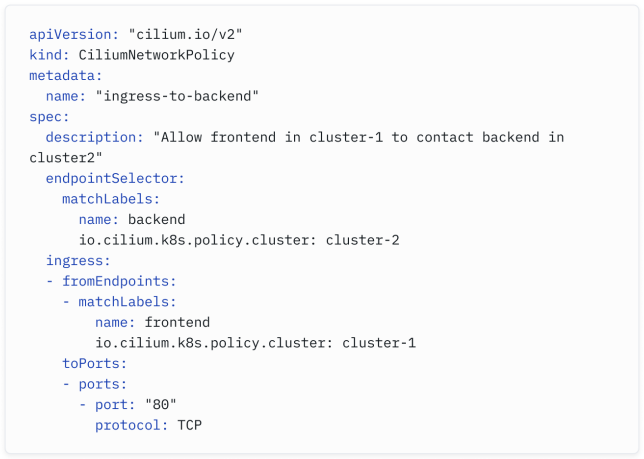

# Is IPv6 supported on Kubernetes?

**Kubernetes 支持 IPv6 吗？**

Yes. Kubernetes has supported IPv6- only clusters since Kubernetes 1.18 and [Dual Stack IPv4/IPv6](https://kubernetes.io/docs/concepts/services-networking/dual-stack/) reached General Availability (GA) in Kubernetes 1.23. 

是的。自 Kubernetes 1.18 起，Kubernetes 已支持 IPv6-only 集群，并且 [Dual Stack IPv4/IPv6](https://kubernetes.io/docs/concepts/services-networking/dual-stack/) 在 Kubernetes 1.23 中已达到一般可用性（GA）。

Like network policies, this depends entirely on whether the CNI plugin supports this feature: not all CNIs support IPv6- only or Dual Stack. The good news: Cilium supports IPv4- only, IPv6- only, and Dual Stack IPv4/IPv6 clusters. 

与网络策略一样，这完全取决于 CNI 插件是否支持此功能：并非所有的 CNI 都支持 IPv6-only 或 Dual Stack。好消息是：Cilium 支持 IPv4-only、IPv6-only 和 Dual Stack IPv4/IPv6 集群。

However, the challenge isn't necessarily whether your pod picks up an IPv6 address at deployment; it's whether you can operate and troubleshoot an IPv6 cluster. Thankfully, Hubble - mentioned earlier - greatly simplifies IPv6 operations. 

然而，挑战并不一定在于您的 Pod 是否在部署时获得 IPv6 地址；而是在于您是否能够操作和排查故障 IPv6 集群。值得庆幸的是，前面提到的 Hubble 极大地简化了 IPv6 操作。

You can, for example, easily find all IPv6 traffic from a particular pod:

例如，您可以轻松地找到特定 Pod 的所有 IPv6 流量：

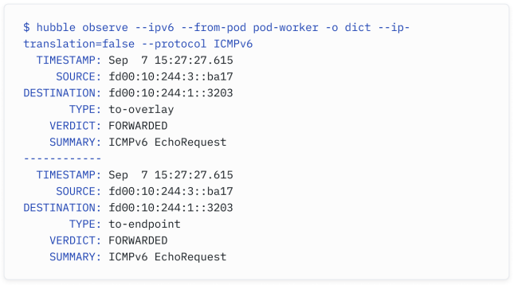

You can also visualize IPv6 service connectivity, using the Hubble UI that comes with Cilium OSS:

您还可以使用附带Cilium OSS的Hubble UI来可视化IPv6服务连接性：

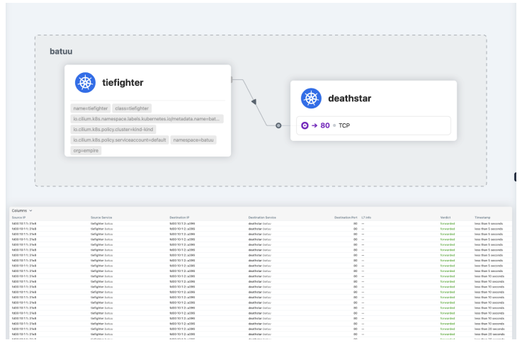

# Does the concept of Quality of Service (QoS) exist in Kubernetes?

**Kubernetes 中是否存在服务质量 (QoS) 概念？**

Let's distinguish between compute QoS and networking QoS. While you're probably thinking of networking QoS, the Kubernetes docs refer to Quality of Service (QoS) for pods. Kubernetes operators can assign a QoS class, which can be used to determine whether to evict pods when node resources are exceeded. The focus of this feature is to prevent CPU and memory starvation. 

让我们区分计算QoS和网络QoS。虽然您可能在思考网络QoS，但Kubernetes文档中提到了用于Pod的服务质量（QoS）。Kubernetes运算符可以分配一个QoS类，该类可用于确定在节点资源超出限制时是否要驱逐Pod。该功能的重点是防止CPU和内存饥饿。

As a network engineer, you would have used networking QoS to prevent bandwidth starvation. Networking QoS encompasses various requirements, such as: Does the concept of Quality of Service (QoS) exist in Kubernetes? 

作为网络工程师，您可能已经使用了网络QoS来防止带宽饥饿。网络QoS涵盖了各种要求，例如：Kubernetes中是否存在服务质量（QoS）的概念？

* Marking: how a network device labels packets with a specific priority marker to ensure they receive preferential treatment throughout the network
* 标记：网络设备如何使用特定的优先级标记对数据包进行标记，以确保它们在整个网络中获得优先处理
* Congestion management: how a network device manages packets as they wait to exit a device 
* 拥塞管理：网络设备在等待从设备退出时如何管理数据包
* Congestion avoidance: how a network device decides if and when to drop packets as a system becomes congested 
* 拥塞避免：网络设备在系统拥塞时如何决定是否以及何时丢弃数据包
* Shaping/Policing: how a network device delays or drops packets to ensure that the throughput does not exceed a defined rate
* 形状/管制：网络设备如何延迟或丢弃数据包，以确保吞吐量不超过定义的速率

As the Kubernetes platform will be running on a physical network, you may want to enforce some level of quality of service within the physical network (out of scope for this document). Within Kubernetes, you should ensure a fair distribution of the node's network interface bandwidth. 

由于Kubernetes平台将在物理网络上运行，您可能希望在物理网络中强制执行一定程度的服务质量（超出本文档的范围）。在Kubernetes中，您应确保节点的网络接口带宽公平分配。

Consider that all pods on a node will typically share a single network interface. If a pod consumes an unfair share of the available bandwidth, the other pods on the node might suffer. 

请考虑，一个节点上的所有Pod通常会共享一个网络接口。如果一个Pod占用了可用带宽的不公平份额，则该节点上的其他Pod可能会受到影响。

With Cilium's Bandwidth Manager, you can mark a Pod by adding an annotation to its specification and shape traffic as it egresses the pod. See an example below:

通过Cilium的带宽管理器，您可以通过将注释添加到其规范中来标记Pod，并在数据从Pod出口时形状流量。请参阅下面的示例：

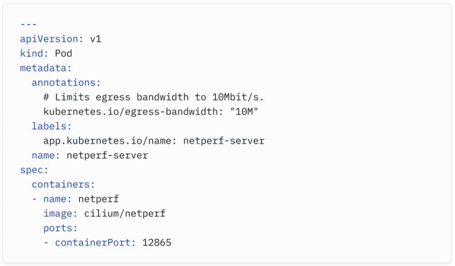

When running a throughput performance test, you would see the egress traffic limited down to just under 10 Mbps:

在运行吞吐量性能测试时，你会看到出口流量被限制在 10 Mbps 以下：

# Which Kubernetes networking options are available in managed Kubernetes services?

**托管的 Kubernetes 服务中提供哪些 Kubernetes 网络选项？**

With most organizations following a cloud-first approach, it is no surprise that many Kubernetes clusters are hosted in cloud providers such as AWS, Azure, and Google Cloud. Some choose to build and manage clusters themselves on platforms such as AWS IaaS service EC2. Still, most organizations tend to gravitate towards the managed Kubernetes services offerings, such as Azure Kubernetes Service (AKS), AWS Elastic Kubernetes Service (EKS) and Google Kubernetes Service (GKE). In these services, the Kubernetes control plane components are managed on your behalf - you get access to your worker nodes and consume your pool of compute resources as you see fit. 

大多数组织都采用云优先的方式，因此许多 Kubernetes 集群托管在 AWS、Azure 和 Google Cloud 等云提供商上是毫不奇怪的。一些组织选择在 AWS 的 IaaS 服务 EC2 等平台上自行构建和管理集群。但大多数组织倾向于使用托管的 Kubernetes 服务，如 Azure Kubernetes Service（AKS）、AWS Elastic Kubernetes Service（EKS）和 Google Kubernetes Service（GKE）。在这些服务中，Kubernetes 控制平面组件由供应商代您管理 - 您可以访问您的工作节点，并根据需要使用计算资源池。

We would need a separate white paper to cover the diversity of Kubernetes networking options in cloud offerings and given how quickly it evolves, it would soon become outdated. However, the majority of the concepts highlighted in this eBook apply. Cilium is either the default networking layer or often recommended by managed service providers and Kubernetes distribution maintainers.

我们需要单独的白皮书来覆盖云服务中 Kubernetes 网络选项的多样性，鉴于其发展速度之快，它很快就会过时。但是，本电子书中突出的大多数概念仍然适用。例如，Cilium 是托管服务提供商和 Kubernetes 发行版维护者的默认网络层或常见推荐选项。

Take AKS and GKE, for example - GKE's datapath v2 is based on [Cilium](https://cloud.google.com/blog/products/containers-kubernetes/bringing-ebpf-and-cilium-to-google-kubernetes-engine), while the preferred option for large- scale clusters on AKS is the "[Azure CNI powered by Cilium](https://azure.microsoft.com/en-us/blog/azure-cni-with-cilium-most-scalable-and-performant-container-networking-in-the-cloud/)" mode. 

以 AKS 和 GKE 为例 - GKE 的 datapath v2 基于 [Cilium](https://cloud.google.com/blog/products/containers-kubernetes/bringing-ebpf-and-cilium-to-google-kubernetes-engine)，而 AKS 大规模集群的首选选项是 "[Azure CNI powered by Cilium](https://azure.microsoft.com/en-us/blog/azure-cni-with-cilium-most-scalable-and-performant-container-networking-in-the-cloud/)" 模式。

Given that these cloud- hosted Kubernetes clusters are managed services, you don't get to choose the Cilium version and the features available. 

鉴于这些云托管的 Kubernetes 集群是托管服务，您无法选择 Cilium 的版本和可用功能。

If you'd like access to all Cilium features, you can, for example, use AKS?s ?Bring-Your- Own- CNI? option. It lets you deploy a cluster without a CNI and install the one of your choice. While this model enables you to install and customize Cilium fully, it comes with the caveat that Microsoft support couldn't help with CNI-related issues. 

如果您希望访问所有 Cilium 功能，例如，您可以使用 AKS 的 "Bring-Your-Own-CNI" 选项。它允许您在没有 CNI 的情况下部署集群，并安装您选择的 CNI。虽然这种模型使您能够完全安装和自定义 Cilium，但请注意，Microsoft 支持无法帮助解决与 CNI 相关的问题。

Head to https://isovalent.com/partners/ for up-to- date information on how the various cloud providers and technology partners are standardizing on Cilium.

请访问 https://isovalent.com/partners/ 获取有关各个云提供商和技术合作伙伴如何在 Cilium 上进行标准化的最新信息。

# Conclusion

**总结**

I hope this book has helped you understand the core building blocks of Kubernetes networking, how pods can communicate with each other and with the outside world, how you can secure the applications running in your cluster, and how you can operate and manage it. 

希望这本书能帮助您理解 Kubernetes 网络的核心构建模块，以及 Pod 如何彼此通信以及与外部世界通信，您如何保护运行在集群中的应用程序，以及您如何操作和管理它。

But there are many intricacies to Kubernetes Networking and Cilium. To keep this eBook brief, we made editorial decisions that experienced Kubernetes architects might question: we decided to omit concepts and tools like headless services, networking namespaces, service meshes, multicast, etc?We also recognize we barely scratched the surface of what eBPF is capable and didn't even mention [Tetragon](https://tetragon.io/).

但是，Kubernetes 网络和 Cilium 存在许多复杂的细节。为了保持本电子书的简洁性，我们做出了一些编辑决策，这些决策可能会受到经验丰富的 Kubernetes 架构师的质疑：我们决定省略诸如无头服务、网络命名空间、服务网格、组播等概念和工具。我们也意识到我们几乎只触及了 eBPF 的能力表面，并且甚至没有提及 [Tetragon](https://tetragon.io/)。

We will save them for another volume. 

我们将它们保留到另一卷中。

We greatly welcome your feedback and comments. Feel free to get in touch on social media to share your thoughts. You can find me on LinkedIn at [@nicolasvibert](https://www.linkedin.cn/incareer/home).

我们非常欢迎您的反馈和评论。请随时通过社交媒体与我们联系，分享您的想法。您可以在 LinkedIn 上找到我，用户名为 [@nicolasvibert](https://www.linkedin.cn/incareer/home)。
