# 前置准备

安装Node.js

[Node.js (nodejs.org)](https://nodejs.org/en)

验证安装结果：

```cmd
node -v
```

配置国内镜像加速：

[npm报错：request to https://registry.npm.taobao.org failed, reason certificate has expired_npm reason: certificate has expired-CSDN博客](https://blog.csdn.net/ganyingxie123456/article/details/135850728)

```cmd
npm config set registry https://registry.npmmirror.com
```

安装Git

[Git - Downloads (git-scm.com)](https://git-scm.com/downloads)

# 安装hexo

安装hexo：

```sh
npm i hexo-cli -g
```

查看安装结果：

```sh
hexo -v
```

> 升级Hexo：[Hexo版本升级指南 | novnan's notes](https://novnan.github.io/Hexo/update_hexo/)

<!--more-->

# 初始化博客目录

在某个空文件夹下运行hexo init命令，将该文件夹初始化，我这里使用blog-site目录

```sh
PS C:\Users\Peng\Desktop\blog-site> hexo init
INFO  Cloning hexo-starter https://github.com/hexojs/hexo-starter.git
INFO  Install dependencies
warning hexo > warehouse > cuid@2.1.8: Cuid and other k-sortable and non-cryptographic ids (Ulid, ObjectId, KSUID, all UUIDs) are all insecure. Use @paralleldrive/cuid2 instead.
warning hexo-renderer-marked > jsdom > domexception@4.0.0: Use your platform's native DOMException instead
warning hexo-renderer-marked > jsdom > abab@2.0.6: Use your platform's native atob() and btoa() methods instead
warning hexo-renderer-marked > jsdom > data-urls > abab@2.0.6: Use your platform's native atob() and btoa() methods instINFO  Start blogging with Hexo!
```

> 有几个warning，不用管

初始化后,在空目录下创建了如下文件:

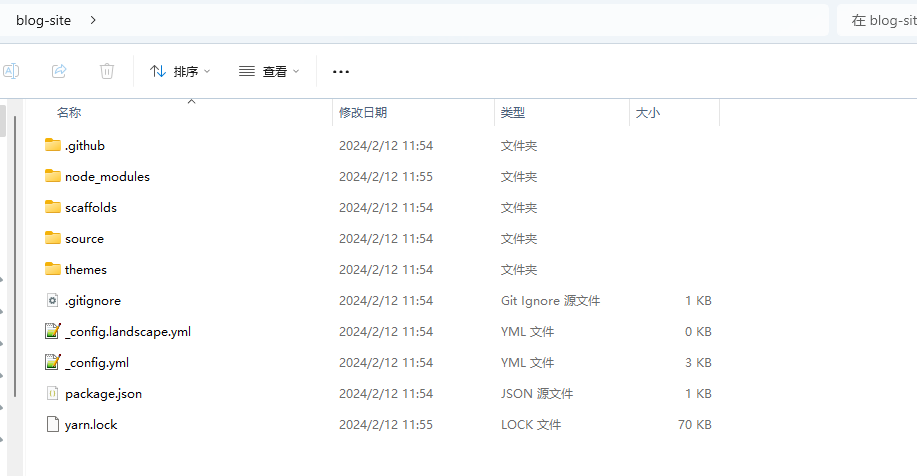

# 本地预览默认网站

初始化之后,就创建了一个博客完整项目,使用`hexo g`命令编译项目,编译完成后使用`hexo s`开启本地服务:

> 或者直接使用`hexo s -g`命令

```sh
PS C:\Users\Peng\Desktop\blog-site> hexo g
INFO  Validating config
.....
INFO  11 files generated in 195 ms
PS C:\Users\Peng\Desktop\blog-site> hexo s
INFO  Validating config
INFO  Start processing
INFO  Hexo is running at http://localhost:4000/ . Press Ctrl+C to stop.
```

输出显示,访问:http://localhost:4000/

访问可以看到一篇名为Hello World的默认文章:

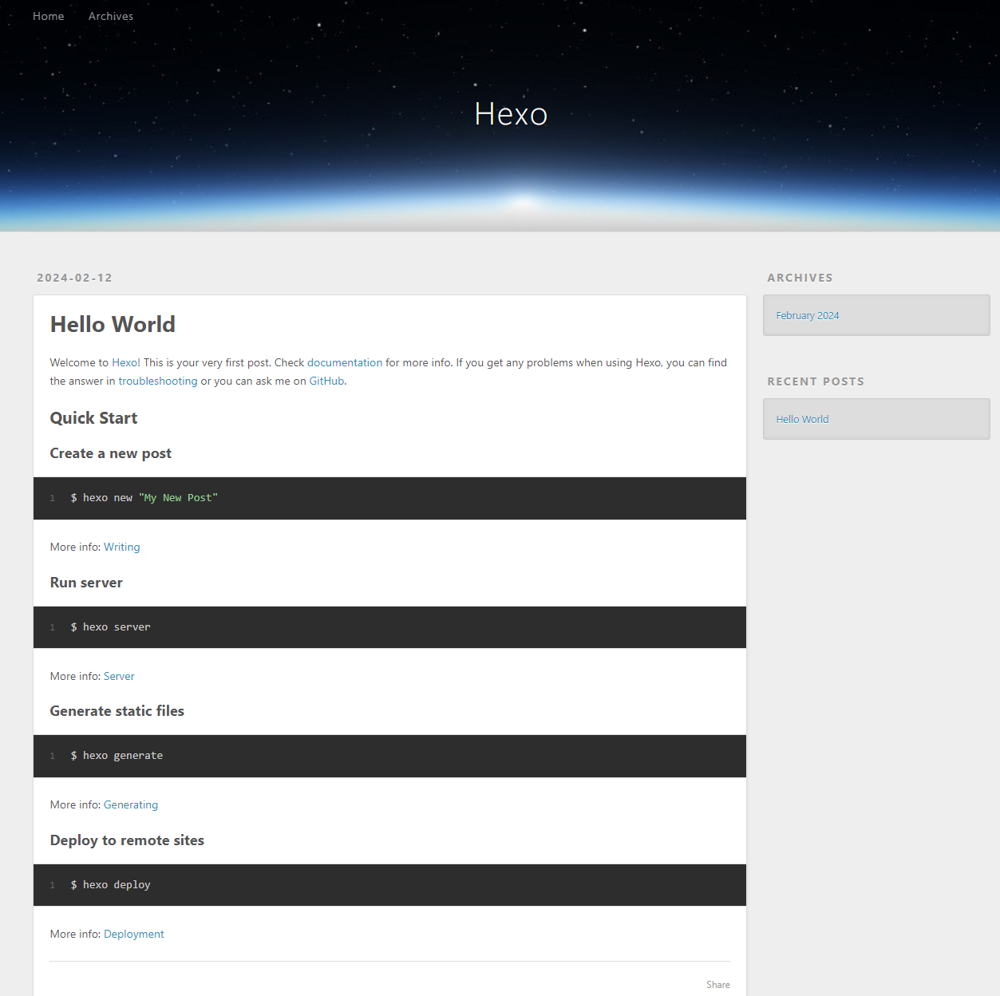

> 文章保存在目录下的`\source\_posts`目录中
>
> 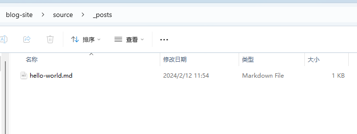

# 编写新文章

文章保存在博客根目录下的`\source\_posts`目录下

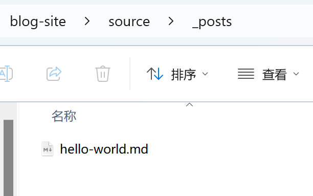


文章中可能需要添加图片,那么还需要额外配置

更改根目录下的`config.yaml`文件中的配置：

```yaml
post_asset_folder: true
```

当该配置被应用后，使用`hexo new`命令创建新文章时，会生成相同名字的文件夹，也就是文章资源文件夹。

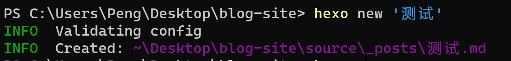

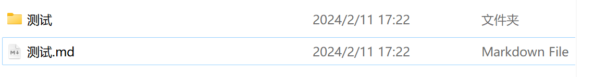

在typro中打开，显示如下:


hexo预览效果:

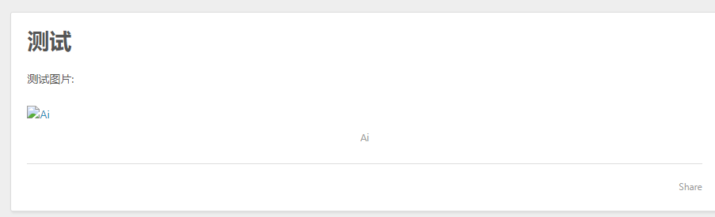

解决方案,添加插件:`https://github.com/CodeFalling/hexo-asset-image`

```sh
PS C:\Users\Peng\Desktop\blog-site> yarn add https://github.com/CodeFalling/hexo-asset-image
yarn add v1.22.21
[1/4] Resolving packages...
[2/4] Fetching packages...
[3/4] Linking dependencies...
[4/4] Building fresh packages...
success Saved lockfile.
success Saved 11 new dependencies.
info Direct dependencies
└─ hexo-asset-image@0.0.5
info All dependencies
├─ cheerio@0.19.0
├─ core-util-is@1.0.3
├─ css-select@1.0.0
├─ css-what@1.0.0
├─ dom-serializer@0.1.1
├─ entities@1.1.2
├─ hexo-asset-image@0.0.5
├─ isarray@0.0.1
├─ lodash@3.10.1
├─ nth-check@1.0.2
└─ readable-stream@1.1.13
Done in 9.77s.
```

添加完插件后,依次使用`hexo clean`, `hexo g` , `hexo s`命令重新生成本地预览,预览效果如下:


# 修改文章

可直接修改文章，并运行`hexo clean`, `hexo g`命令重新生成

# 修改文章的访问路径

文章的默认访问路径是日期+文章名：`/2024/02/12/测试/`

修改为类似：`blogs/1234`

**实现方式**

修改_config文件中permalink的值

```yaml
permalink: blogs/:abbrlink/
```

在hexo博客的主目录下安装hexo-abbrlink

```sh
yarn add hexo-abbrlink --save
```

这样，使用`hexo g`重新生成的博客，将会添加abbrlink属性

> 如果发生图片访问不到的情况，请使用`hexo clean`命令清除一下环境


文章的访问路径也改变了：

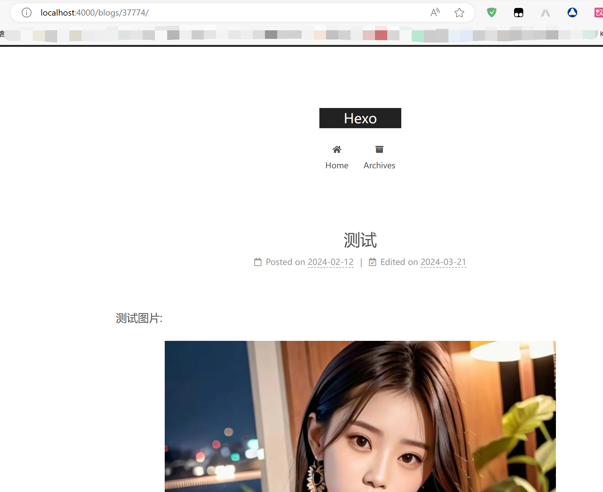


# 将博客托管到GitHub

## 新建GitHub仓库

需要自己先注册GitHub账号

注册完账号后,创建一个新仓库,仓库的名字需要满足以下格式:

`账户名`+`.github.io`

比如我的github账户名为:`Jiajun-Peng`,那么我创建的新仓库名为:`Jiajun-Peng.github.io`

具体的创建步骤如下:

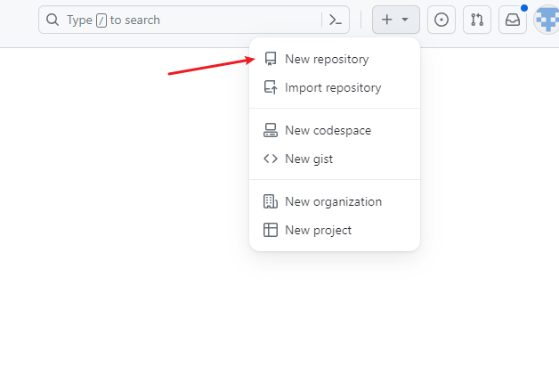

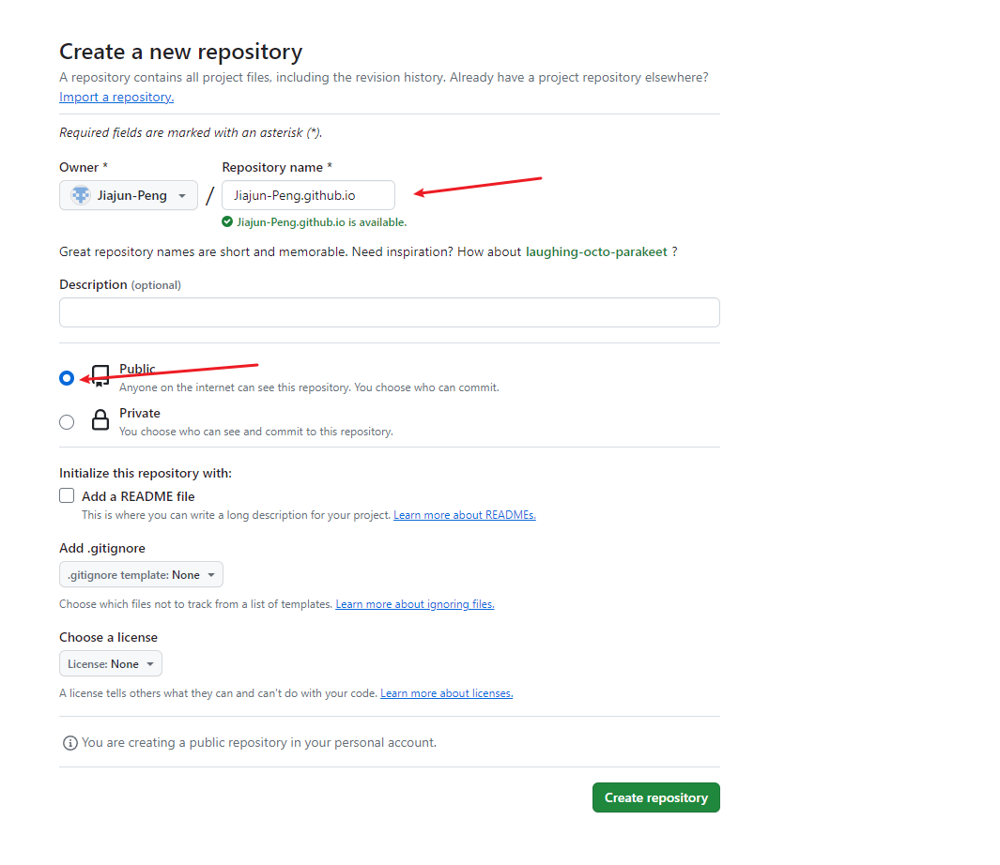

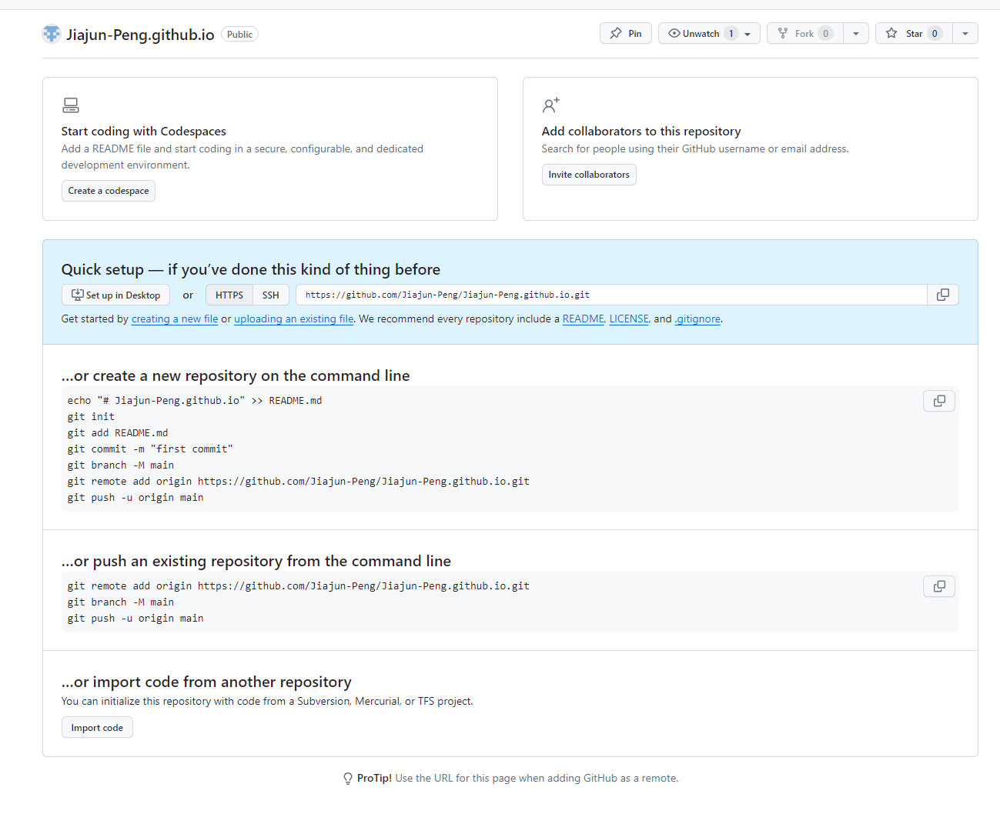

## 关联本地博客到GitHub并发布

目前,我的GitHub仓库的地址是:`https://github.com/Jiajun-Peng/Jiajun-Peng.github.io.git`

修改博客根目录中的`_config.yml`文件,并修改deploy位置的配置,配置如下:

```yaml
deploy:
  type: git
  repository: https://github.com/Jiajun-Peng/Jiajun-Peng.github.io.git
  branch: master
```

在发布到远程仓库之前,还需安装`hexo-deployer-git`插件，命令：

`yarn add hexo-deployer-git`

```sh
PS C:\Users\Peng\Desktop\blog-site> yarn add hexo-deployer-git
yarn add v1.22.21
[1/4] Resolving packages...
[2/4] Fetching packages...
[3/4] Linking dependencies...
[4/4] Building fresh packages...
success Saved lockfile.
success Saved 2 new dependencies.
info Direct dependencies
└─ hexo-deployer-git@4.0.0
info All dependencies
├─ hexo-deployer-git@4.0.0
└─ luxon@3.4.4
Done in 1.77s.
```

安装完成后,使用`hexo d`命令即可发布到GitHub.


发布成功后,可以在Github网站页面看到:

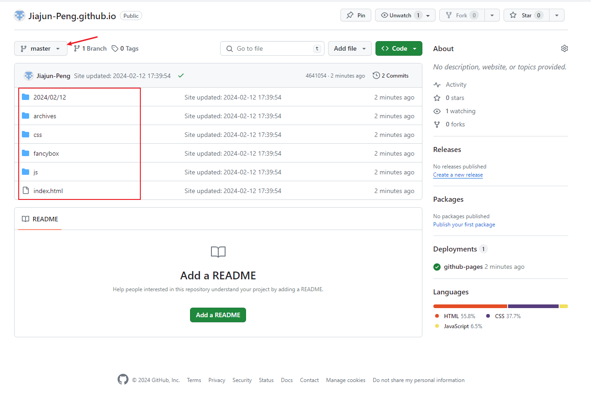

在Settings -> Pages页即可以看到博客的访问地址:

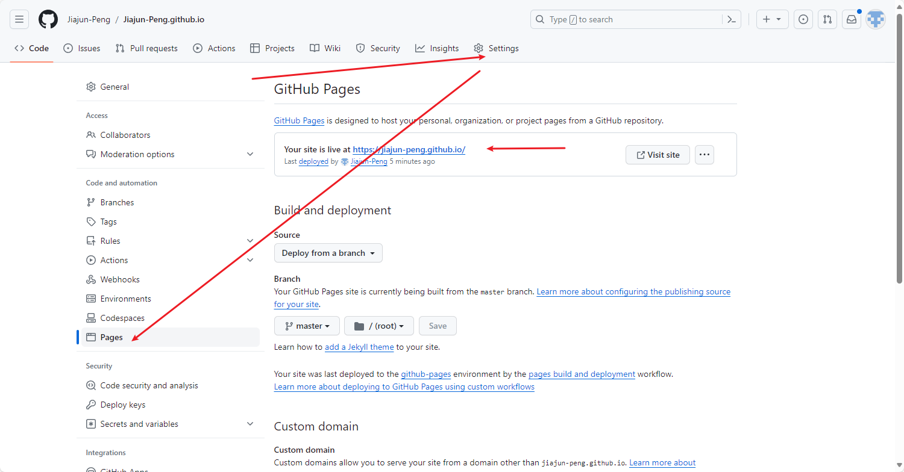

访问https://jiajun-peng.github.io/,可以看到我们的第一篇测试文章

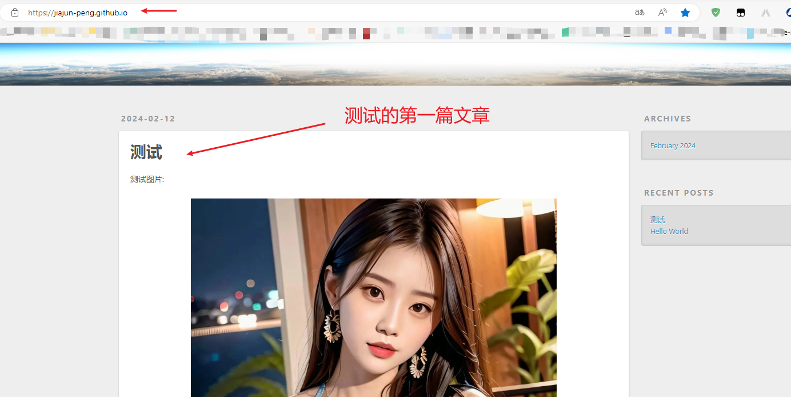

## 配置域名访问

比如我有一个名为`nobug.world`的域名，我希望使用这个域名访问博客，那么可以将域名的解析到github的地址

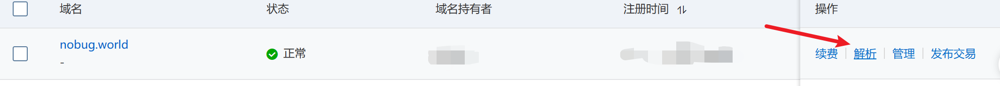

增加两条解析记录：

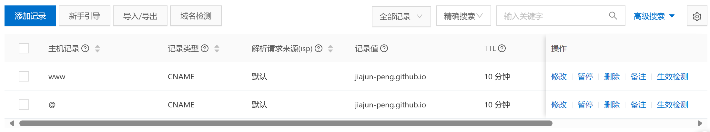

并在github上配置自定义域名：

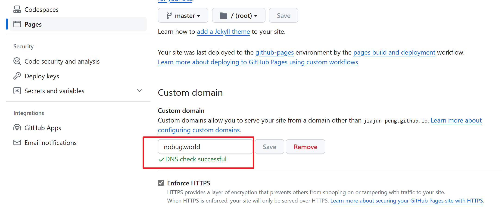

接着，就可以使用域名访问博客了

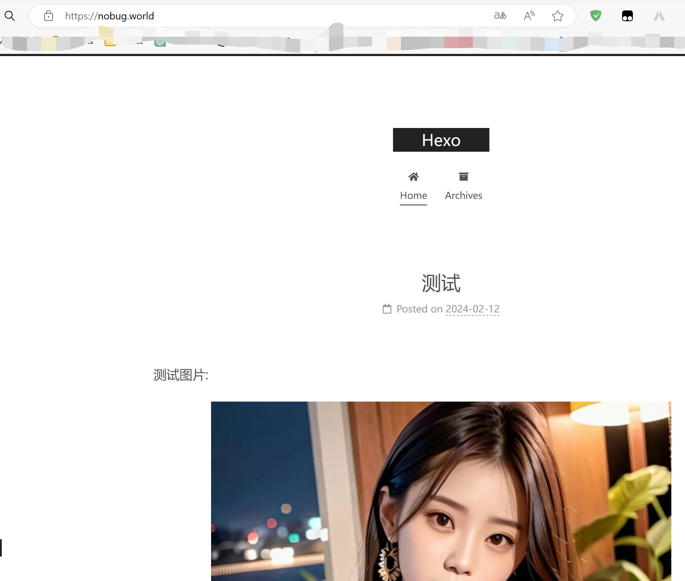

## 解决 Hexo 部署 Github Pages 自定义域名失效的问题

参考：[解决 Hexo 部署 Github Pages 自定义域名失效的问题(即使已添加 CNAME）_gitpages cname值在哪里找到-CSDN博客](https://blog.csdn.net/weixin_41747528/article/details/102772937)


# 切换主题

[主题 | Hexo](https://hexo.io/zh-cn/docs/themes.html)

更换 Hexo 主题非常容易，只要在 根目录下的`themes` 文件夹内，新增一个名为主题名称的文件夹(用于存放主题文件)，并修改 `_config.yml` 内的 `theme` 设置，即可切换主题。

这里选用Next作为新主题.

切换主题的步骤是,下载主题文件,并将文件放到themes文件夹中,下载主题文件的方式即可以从待选用主题的官网下载也可以去github上将该主题clone下来.

Next的Github仓库:[next-theme/hexo-theme-next: 🎉 Elegant and powerful theme for Hexo. (github.com)](https://github.com/next-theme/hexo-theme-next)

> [Hexo Next 主题版本 (V8+) 的那些事](https://hyf.js.org/2022/10/2022-10-Hexo-Next-v8-versions-Waline/)

这里使用clone的方式下载主题,切换路径到博客的根目录,再clone:

```sh
git clone https://github.com/next-theme/hexo-theme-next themes/next
```

下载完成后,themes目录下多了一个名为next的目录,其中保存了主题的相关文件:

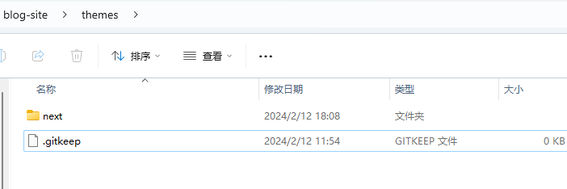

修改配置:

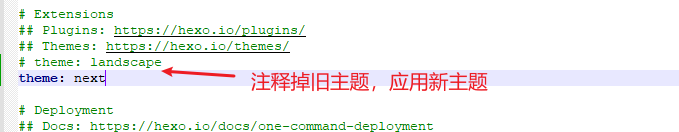

重新生成预览后:


# node.js证书过期问题

使用`hexo init`命令初始化：

```sh
PS C:\Users\Peng\Desktop\blog-site> hexo init
INFO  Cloning hexo-starter https://github.com/hexojs/hexo-starter.git
INFO  Install dependencies
error Error: certificate has expired
    at TLSSocket.onConnectSecure (node:_tls_wrap:1674:34)
    at TLSSocket.emit (node:events:518:28)
    at TLSSocket._finishInit (node:_tls_wrap:1085:8)
    at ssl.onhandshakedone (node:_tls_wrap:871:12)
WARN  Failed to install dependencies. Please run 'npm install' in "C:\Users\Peng\Desktop\blog-site" folder.
```

输出显示node相关的证书过期，此时下方提示您使用`npm install`，当然也可以使用`yarn`

当我们运行`yarn`命令，依然会提示证书过期的问题

```sh
PS C:\Users\Peng\Desktop\blog-site> yarn
yarn install v1.22.21
info No lockfile found.
[1/4] Resolving packages...
error Error: certificate has expired
    at TLSSocket.onConnectSecure (node:_tls_wrap:1674:34)
    at TLSSocket.emit (node:events:518:28)
    at TLSSocket._finishInit (node:_tls_wrap:1085:8)
    at ssl.onhandshakedone (node:_tls_wrap:871:12)
info Visit https://yarnpkg.com/en/docs/cli/install for documentation about this command.
```

**解决方案**

查看yarn配置，可见strict-ssl的值为true，意味着需要使用到CA证书

```sh
PS C:\Users\Peng\Desktop\blog-site> yarn config list
yarn config v1.22.21
info yarn config
{
  'version-tag-prefix': 'v',
  'version-git-tag': true,
  'version-commit-hooks': true,
  'version-git-sign': false,
  'version-git-message': 'v%s',
  'init-version': '1.0.0',
  'init-license': 'MIT',
  'save-prefix': '^',
  'bin-links': true,
  'ignore-scripts': false,
  'ignore-optional': false,
  registry: 'https://registry.yarnpkg.com',
  'strict-ssl': true,
  'user-agent': 'yarn/1.22.21 npm/? node/v20.11.0 win32 x64',
  lastUpdateCheck: 1707636739137
}
info npm config
{
  registry: 'https://registry.npm.taobao.org'
}
Done in 0.03s.
```

设置禁用ssl：

```sh
PS C:\Users\Peng\Desktop\blog-site> yarn config set strict-ssl false
yarn config v1.22.21
success Set "strict-ssl" to "false".
Done in 0.03s.
PS C:\Users\Peng\Desktop\blog-site>
```

设置完后，再使用`yarn`命令安装依赖：

```sh
PS C:\Users\Peng\Desktop\blog-site> yarn
yarn install v1.22.21
info No lockfile found.
[1/4] Resolving packages...
warning hexo > warehouse > cuid@2.1.8: Cuid and other k-sortable and non-cryptographic ids (Ulid, ObjectId, KSUID, all UUIDs) are all insecure. Use @paralleldrive/cuid2 instead.
warning hexo-renderer-marked > jsdom > domexception@4.0.0: Use your platform's native DOMException instead
warning hexo-renderer-marked > jsdom > abab@2.0.6: Use your platform's native atob() and btoa() methods instead
warning hexo-renderer-marked > jsdom > data-urls > abab@2.0.6: Use your platform's native atob() and btoa() methods instead
[2/4] Fetching packages...
[3/4] Linking dependencies...
[4/4] Building fresh packages...
success Saved lockfile.
Done in 10.64s.
```

# 无法访问github仓库的问题

可以在浏览器中访问github(使用vpn),但无法在控制台使用git clone命令来克隆github中的仓库到本地:

```sh
Failed to connect to github.com port 443
```

**解决方案**

windows系统中打开设置–网络–代理

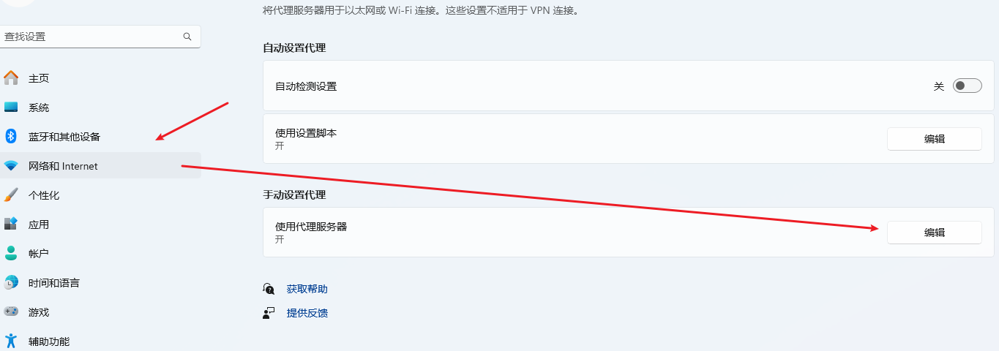

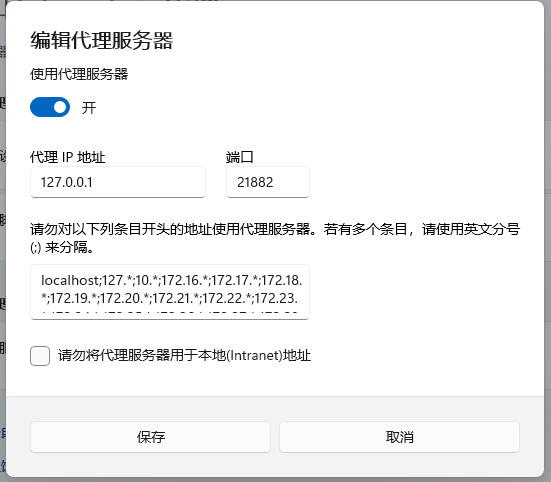

**打开代理服务器,并为git设置该代理服务器**

查看git配置:

```sh
$ git config --list
diff.astextplain.textconv=astextplain
filter.lfs.clean=git-lfs clean -- %f
filter.lfs.smudge=git-lfs smudge -- %f
filter.lfs.process=git-lfs filter-process
filter.lfs.required=true
http.sslbackend=openssl
http.sslcainfo=C:/Program Files/Git/mingw64/etc/ssl/certs/ca-bundle.crt
core.autocrlf=true
core.fscache=true
core.symlinks=false
pull.rebase=false
credential.helper=manager
credential.https://dev.azure.com.usehttppath=true
init.defaultbranch=master
user.name=Jiajun-Peng
user.email=pengjiajun566@gmail.com
```

设置git代理服务器:

```sh
$ git config --global http.proxy 127.0.0.1:21882
```

设置完之后,就可以使用git clone来克隆github中的仓库了

> 如果需要取消使用代理,可以使用如下命令:
>
> ```sh
> git config --global --unset http.proxy
> ```

# 设置首页文章折叠-reade more

next主题默认在首页展示文章全文，一般我们希望仅展示部分内容，样式如下：

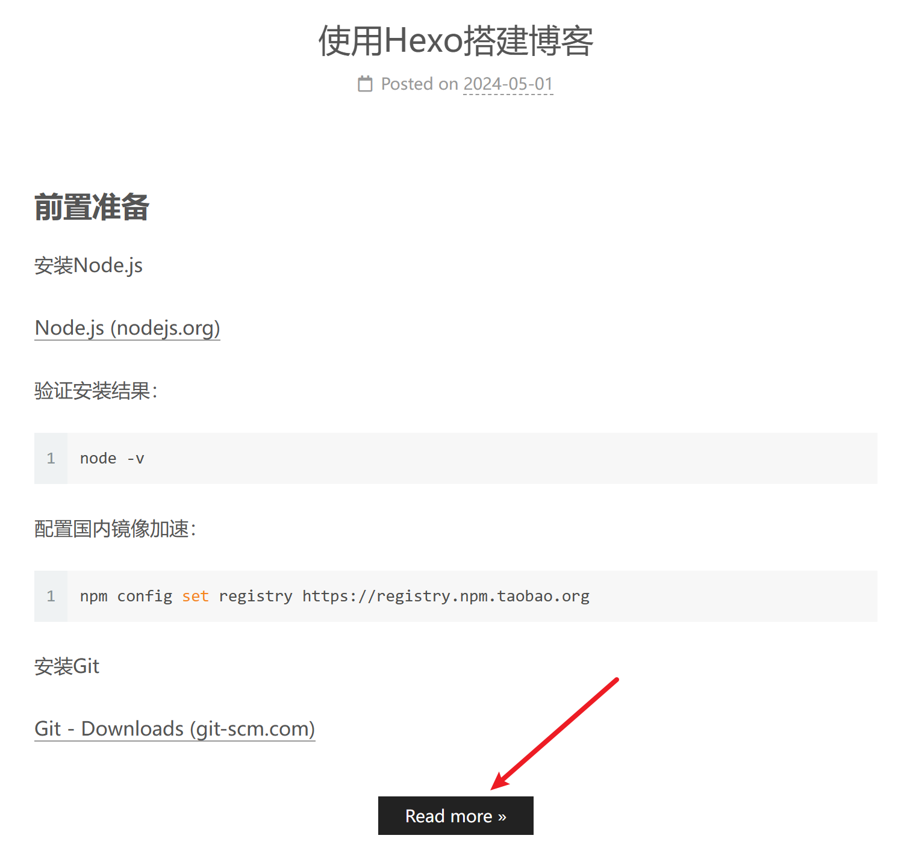

## 设置Read more

我采用的方案是在文章需要隐藏的内容之前添加`<!--more-->`。

参考：[请问如何设置read more? · Issue #62 · iissnan/hexo-theme-next (github.com)](https://github.com/iissnan/hexo-theme-next/issues/62)

## 设置Read more的跳转锚点

默认情况下，点击Read more是跳转到文章详情中设置`!--more-->`的位置，但我个人希望跳转到文章的起始位置。

老版本中可以在主题的config文件中将`scroll_to_more` 选项设置`false`实现。

我使用的版本则需要修改，代码源文件，修改的文件是：`\themes\next\layout\_macro\post.njk`

> 有些版本中不是post.njk文件，对应的则是修改`\themes\next\layout_macro\post.swig`

将：

```html
<a class="btn" href="{{ url_for(post.path) }}#more" rel="contents">
```

修改为:

```html
<a class="btn" href="{{ url_for(post.path) }}" rel="contents">
```

即删掉`#more`

# 添加Waline评论

## 添加评论组件

参考：

[快速上手 | Waline](https://waline.js.org/guide/get-started/)

[Waline 评论系统的介绍与基础配置 | 荷戟独彷徨 (guanqr.com)](https://guanqr.com/tech/website/introduction-and-basic-setting-of-waline/)

[Hexo 使用 Waline 评论系统（Hexo Next 主题版本 (V8+) 的那些事） | Y.a.F.e.Y Blog (hyf.js.org)](https://hyf.js.org/2022/10/2022-10-Hexo-Next-v8-versions-Waline/)

[Hexo博客进阶：为 Next 主题添加 Waline 评论系统_waline/hexo-next-CSDN博客](https://blog.csdn.net/jiunian_2761/article/details/122621667)

[Hexo使用Waline评论系统 - 知乎 (zhihu.com)](https://zhuanlan.zhihu.com/p/408073423)

注意点：

* 如果使用Next主题的话需要确保版本是8.0+

* 拉取评论时可能报401 Unauthorized异常，原因是waline的serverURL没有正确设置，**不要**设置为中间有一段随机英文字符的域名

## 管理评论

由于 Waline 有服务端，支持评论管理。第一个账号作为管理员。

找到评论框，点击 登录 按钮，会弹出一个窗口，找到用户注册。

注册好，登录之后即可进入评论管理的后台（https://xxxx.vercel.app/ui），可以对评论进行管理。

或者 登录到 Leancloud 上的 数据库进行管理。


# 设置文章阅读进度

修改主题目录下config文件的`back2top`参数，如下：

```yml
back2top:
  enable: true
  # Back to top in sidebar.
  sidebar: false
  # Scroll percent label in b2t button.
  scrollpercent: true
```

# 设置作者名

设置hexo目录下的config文件的`author`选项的值：

```yml
author: Peng Jiajun
```


# 设置文章目录显示

设置主题目录下的config文件的`toc`选项的值：

```yml
# Table of Contents in the Sidebar
# Front-matter variable (nonsupport wrap expand_all).
toc:
  enable: true
  # Automatically add list number to toc.
  number: true
  # If true, all words will placed on next lines if header width longer then sidebar width.
  wrap: false
  # If true, all level of TOC in a post will be displayed, rather than the activated part of it.
  expand_all: true
  # Maximum heading depth of generated toc.
  max_depth: 6
```

